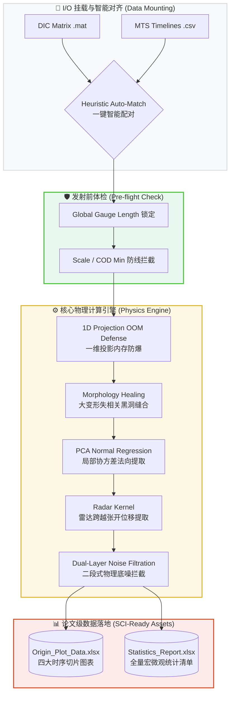

# CrackVision-DIC: High-Performance Micro-Cracking Kinetics Engine

[](https://www.python.org/downloads/)
[](https://wiki.qt.io/Qt_for_Python)
[](https://opensource.org/licenses/MIT)

CrackVision-DIC 是一个专为高延性水泥基复合材料（ECC/UHPC）设计的高性能微观开裂动力学分析计算框架。

本引擎专注于底层物理计算与数据降维。它通过摄入数字图像相关法（DIC）的宏观应变场与 MTS 试验机的力学时序数据，利用底层 C 级 JIT 编译算子，自动提取亚像素级裂缝骨架，并最终输出完全对齐 OriginLab 绘图标准的统计学宽表，直接赋能高水平 SCI 论文的力学机制深度解析。

---

## 🧭 系统核心架构 (System Architecture)


## 📐 数学与物理机理核心 (Mathematical & Physical Core)

本内核严格遵循连续损伤力学（CDM）与断裂力学范式，核心算法受以下物理张量与统计算子驱动：

### 1. 局部协方差张量与物理法向回归 (PCA-based Normal Regression)
为消除离散像素网格引起的阶梯伪影，引擎基于 $3 \times 3$ 邻域协方差矩阵对骨架点进行主成分分析（PCA）。其局部裂缝法向角 $\theta$ 的精确解析解为：

$$\theta=\frac{1}{2}\arctan\left(\frac{2\sum\Delta x\Delta y}{\sum\Delta x^2-\sum\Delta y^2}\right)$$

通过求解法向矢量 $\mathbf{n}=(-\sin\theta,\cos\theta)$，确保了位移跳跃（Jump Displacement）提取路径与裂缝走向的绝对正交性。

### 2. 张开模式 (Mode I) 裂宽的亚像素投影算子
针对 DIC 位移场 $u_x$，引擎沿法线 $\mathbf{n}$ 跨越主应变奇异区，利用双线性插值提取微区位移跳跃，并向法向严格投影，以剔除纯剪切滑移（Sliding Mode II）的寄生干扰：

$$w=\left|(u_x^+-u_x^-)\cdot n_x\right|\times R_{scale}$$

*(其中 $R_{scale}$ 为自动嗅探的空间物理标定分辨率 mm/px)*

### 3. 多梯度概率密度演化 (Probabilistic Evolution Modeling)
引擎追踪特征阈值（如 $\varepsilon_{100\mu m}$），定量评估材料在海洋环境下防止氯离子渗透的物理屏障可靠性：

$$\varepsilon_{threshold}=\text{argmin}_{\varepsilon}\{\max(w_i)\geq100\mu m\}$$

---

## 🚀 核心特性与工程防线 (Key Features & Defenses)

- **一维列投影内存防爆 (1D Projection OOM Defense)**: 彻底摒弃高维矩阵广播，采用列维度有效像素统计算法，在保持全局应变精度的前提下，将 12GB+ 的巨量内存开销降至近乎为 0。
- **大变形失相关跨越 (Decorrelation Healing)**: 引入“形态学缝合”与“雷达探测内核”。即使试件在局部化破坏阶段发生严重的散斑剥落（NaN 黑洞），引擎亦能向外延伸探测，精准捕获极限主裂缝的真实张开量。
- **智能批处理对齐 (Heuristic Batch Pairing)**: 独创智能扫盘对齐算法。基于命名相似度矩阵，一键完成数十组 DIC `.mat` 与力学 `.csv` 的时域映射，支持通过 CheckBox 自由勾选或隔离异常试件。
- **双重物理降噪 (Dual-Layer Noise Filtration)**: 引入严格的对象级物理防线（如 $W_{max}\geq5\mu m$ 且 $W_{avg}\geq2\mu m$），结合 $5000 \mu\epsilon$ 的应变天花板拦截，彻底抹杀无物理意义的亚微米级“数学幽灵”。

---

## 📊 输出图表矩阵 (SCI Publication Ready)

引擎每次运行固定生成极简的工业级数据资产，彻底告别“找数据拼图”，所有结构均被硬编码锁定以支持脚本无脑拼接：

### 1. `[试件名]_Origin_Plot_Data.xlsx` (Origin 画图专供矩阵)
高度格式对齐，支持直接导入 OriginLab 渲染顶级图表：
* `Fig1_Dynamics`: 宏微观演化动力学 (双 Y 轴)。
* `Fig2_Normalized`: 归一化横向对比矩阵 (对齐不同批次试件的软化点)。
* `Fig3_Distribution`: 饱和态与极限态微观裂宽的概率分布 (专供 Violin/Boxplot)。
* `Fig4_Gradient`: 核心应变节点 (如 1%, 2%, 4%...) 的多梯度切片宽表 (专供 Ridgeline 瀑布图)。

### 2. `[试件名]_Statistics_Report.xlsx` (科研全量底稿)
* `01_Macro_Summary`: 极值快照汇总 (UTS、极限应变、饱和裂缝间距等)，供直接填入论文 Table。
* `02_Gradient_States`: 审稿人视角的应变梯度演化核心数据表。
* `03_Saturated_Cracks` / `04_Ultimate_Cracks`: 单缝“身份明细档案”，精确追踪微裂缝的卸载闭合机制 (Healing/Unloading)。

---

## 🛠️ 安装与部署 (Installation)

```bash
# 1. 克隆代码仓库
git clone [https://github.com/liqinglq666/CrackVision-DIC.git](https://github.com/liqinglq666/CrackVision-DIC.git)
cd CrackVision-DIC

# 2. 部署计算环境
conda create -n crackvision_env python=3.10 -y
conda activate crackvision_env

# 3. 挂载依赖清单
pip install -r requirements.txt

# 4. 启动可视化引擎
python main.py