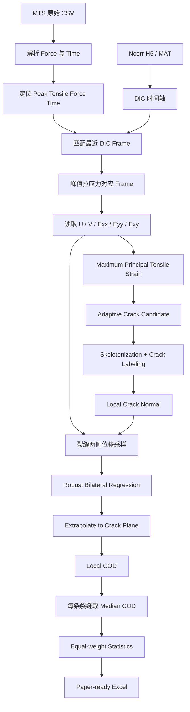
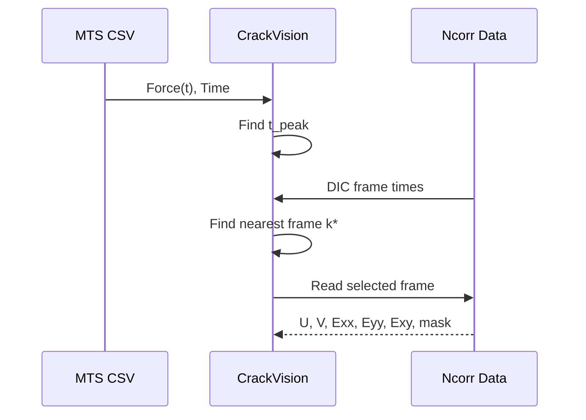
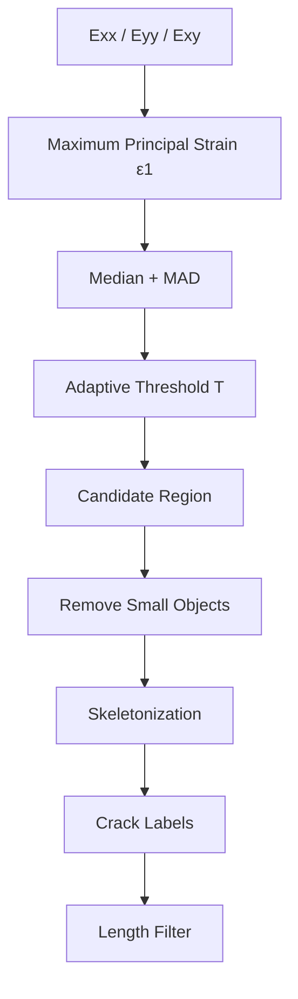
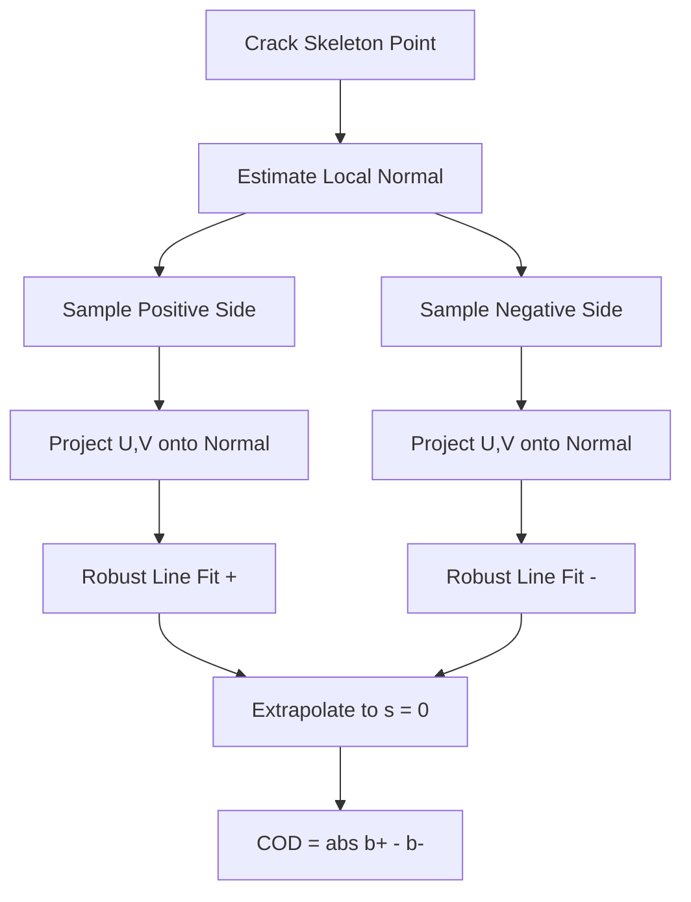
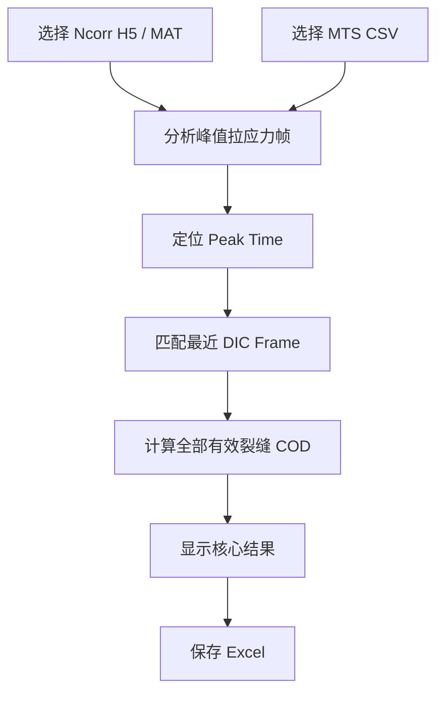
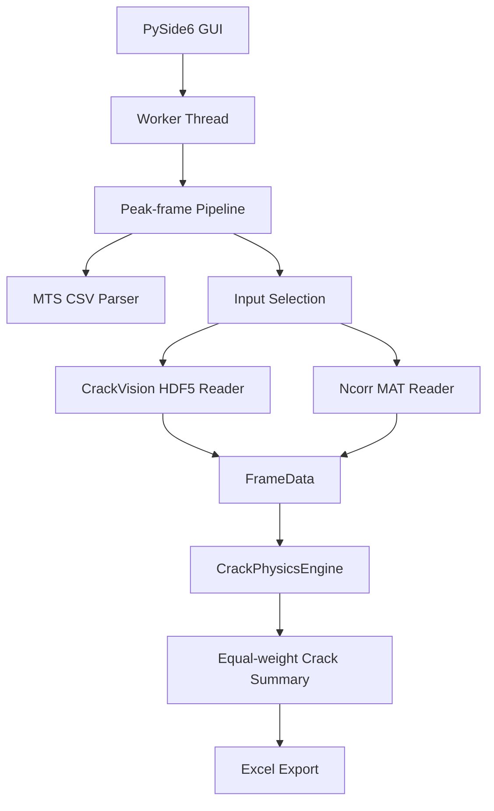

# CrackVision-DIC

<p align="center">
  <strong>面向 ECC / SHCC 单轴拉伸试验的峰值拉应力状态裂缝宽度分析工具</strong><br/>
  <sub>Peak-stress-state Crack Opening Displacement Analysis based on Ncorr DIC + MTS</sub>
</p>

<p align="center">
  
  
  
  
</p>

---

## 项目简介 · Overview

**CrackVision-DIC** 是一个用于 **ECC / SHCC 单轴拉伸 Digital Image Correlation (DIC)** 后处理的科研工具。

软件读取 **MTS 原始拉伸数据**与 **Ncorr DIC 数据**，自动定位 Peak Tensile Stress 对应时刻，匹配最近的 DIC frame，并在该帧中完成裂缝识别与 **Crack Opening Displacement (COD)** 计算。

最终得到：

- 峰值拉应力对应的 DIC frame；
- 峰值状态下全部有效裂缝的代表宽度；
- specimen-level 平均 / 中位 / P95 / 最大裂缝宽度；
- 时间匹配、尺度、阈值、有效区等 QA 信息；
- 可直接用于论文整理的 Excel workbook。

当前实验时间轴定义为：

```text
MTS t = 0 s  ⇔  DIC frame 0 = 0 s
```

即 MTS 与图像采集同步起始。

---

## 整体流程 · Scientific Workflow


```mermaid
flowchart TD
    A[MTS 原始 CSV] --> B[解析 Force 与 Time]
    B --> C[定位 Peak Tensile Force Time]

    D[Ncorr H5 / MAT] --> E[DIC 时间轴]
    C --> F[匹配最近 DIC Frame]
    E --> F

    F --> G[峰值拉应力对应 Frame]
    G --> H[读取 U / V / Exx / Eyy / Exy]

    H --> I[Maximum Principal Tensile Strain]
    I --> J[Adaptive Crack Candidate]
    J --> K[Skeletonization + Crack Labeling]
    K --> L[Local Crack Normal]

    H --> M[裂缝两侧位移采样]
    L --> M
    M --> N[Robust Bilateral Regression]
    N --> O[Extrapolate to Crack Plane]
    O --> P[Local COD]

    P --> Q[每条裂缝取 Median COD]
    Q --> R[Equal-weight Statistics]
    R --> S[Paper-ready Excel]
```

核心计算链：

```text
MTS Peak State
    ↓
DIC Peak Frame
    ↓
Maximum Principal Tensile Strain
    ↓
Crack Geometry
    ↓
Displacement Jump along Local Normal
    ↓
COD
    ↓
Crack-wise Representative Width
    ↓
Equal-weight Specimen Statistics
```

---

# 1. 峰值拉应力帧选择 · Peak-stress Frame Selection

## 1.1 Peak Tensile Stress 对应时刻

对名义截面积 `A` 固定的拉伸试件：

```text
σ(t) = F(t) / A
```

由于 `A` 为常数：

```text
arg max_t σ(t) = arg max_t F(t)
```

因此 **Peak Tensile Stress 与 Peak Tensile Force 出现在同一时刻**。

软件从 MTS CSV 中读取：

```text
Force
Time
```

对于拉伸力采用不同正负号约定的 MTS 数据，程序先判断 tension sign：

```text
s ∈ {-1, +1}
```

峰值时刻定义为：

```text
t_peak = arg max_t [s · F(t)]
```

MTS 数据在该流程中用于确定 Peak Tensile Stress 对应时刻；COD 则由 Ncorr displacement field 计算。

## 1.2 峰值时刻与 DIC frame 匹配

设 DIC 时间轴为：

```text
t_DIC(0), t_DIC(1), ..., t_DIC(N-1)
```

目标 frame 为距离 `t_peak` 最近的一帧：

```text
k* = arg min_k |t_DIC(k) - t_peak|
```

时间匹配误差定义为：

```text
Δt = t_DIC(k*) - t_peak
```

当前图像采集间隔为 **5 s / image**。在 MTS 与图像同步起始的条件下，软件依据最近时间点完成 frame matching，并将 `Δt` 写入 QA 结果。


```mermaid
sequenceDiagram
    participant MTS as MTS CSV
    participant CV as CrackVision
    participant DIC as Ncorr Data

    MTS->>CV: Force(t), Time
    CV->>CV: Find t_peak
    DIC->>CV: DIC frame times
    CV->>CV: Find nearest frame k*
    CV->>DIC: Read selected frame
    DIC-->>CV: U, V, Exx, Eyy, Exy, mask
```

---

# 2. Ncorr 数据接口 · Data Contract

CrackVision-DIC 支持：

```text
CrackVision-Ncorr HDF5 (.h5 / .hdf5)
Ncorr MAT (.mat)
```

推荐使用 **compact HDF5 bridge**。该格式保存裂缝宽度分析需要的 DIC field 与物理尺度元数据，并支持按时间直接读取目标 frame。

## 2.1 Ncorr → CrackVision HDF5

完成 Ncorr：

```text
DIC Analysis
→ Format Displacements
→ Get Unit Conversion (mm)
→ Calculate Strains
```

然后在 MATLAB 中运行：

```matlab
handles_ncorr = ncorr;
% ... 完成正常 Ncorr 计算 ...

addpath('path/to/CrackVision-DIC/matlab')
export_ncorr_to_crackvision( ...
    handles_ncorr, ...
    'Specimen01_CrackVision.h5', ...
    5);   % 5 s / image
```

已有 Ncorr MAT 也可转换：

```matlab
export_ncorr_to_crackvision( ...
    'Specimen01.mat', ...
    'Specimen01_CrackVision.h5', ...
    5);
```

## 2.2 HDF5 数据结构

```text
/
├─ fields/
│  ├─ u
│  ├─ v
│  ├─ exx
│  ├─ eyy
│  ├─ exy
│  └─ mask
├─ time_s
└─ attributes
   ├─ coordinate_system = reference
   ├─ strain_measure = Green-Lagrange
   ├─ pixel_size_mm
   ├─ ncorr_spacing_raw
   ├─ dic_step_px
   ├─ dic_point_spacing_mm
   ├─ sampling_interval_s
   └─ numeric_precision
```

位移与应变统一采用 **Reference Configuration**：

```text
plot_u_ref_formatted
plot_v_ref_formatted
plot_exx_ref_formatted
plot_eyy_ref_formatted
plot_exy_ref_formatted
```

## 2.3 Ncorr spacing 与物理网格间距

Ncorr 原生 `spacing` 按 skipped-pixel count 处理：

```text
DIC centre step (px) = Ncorr spacing + 1
```

记作：

```text
Δp_DIC = spacing_Ncorr + 1
```

若图像尺度为：

```text
p = pixel_size_mm   [mm/pixel]
```

则 DIC 网格物理间距为：

```text
Δx_DIC = p · Δp_DIC   [mm/point]
```

其中：

```text
pixel_size_mm        → displacement pixel → mm
dic_point_spacing_mm → DIC grid index → physical distance
```

---

# 3. 裂缝定位 · Maximum Principal Tensile Strain

裂缝候选区域基于 **Maximum Principal Tensile Strain** 定位。

二维 Green-Lagrange strain tensor 对应的最大主拉应变为：

```text
ε1 = (Exx + Eyy) / 2
     + sqrt( ((Exx - Eyy) / 2)^2 + Exy^2 )
```

当前 Ncorr bridge 中，`Exy` 按 **tensor Green-Lagrange shear component** 处理。

由于 ECC / SHCC 裂缝可能呈水平、竖直或倾斜方向，Maximum Principal Tensile Strain 能够以统一方式描述不同取向的局部拉应变集中。

---

# 4. 自适应阈值 · Robust Adaptive Threshold

峰值帧的裂缝候选区使用 robust background-dependent threshold。

背景中位数：

```text
m = median(ε1)
```

Median Absolute Deviation：

```text
MAD = median( |ε1 - m| )
```

robust scale：

```text
σ_robust = 1.4826 · MAD
```

原始 threshold：

```text
T_raw = m + k · σ_robust
```

当前默认：

```text
k = 2.0
```

最终 threshold：

```text
T = clip(T_raw, 2e-4, 5e-2)
```

候选 crack region：

```text
ε1 ≥ T  and  ε1 > 0
```

随后进行：

```text
Small-object Removal
→ Skeletonization
→ Connected-component Labeling
→ Minimum Length Filter
```

当前默认：

```text
min_crack_area_points = 4
min_crack_length_mm   = 0.15 mm
```


```mermaid
flowchart TD
    A[Exx / Eyy / Exy] --> B[Maximum Principal Strain ε1]
    B --> C[Median + MAD]
    C --> D[Adaptive Threshold T]
    D --> E[Candidate Region]
    E --> F[Remove Small Objects]
    F --> G[Skeletonization]
    G --> H[Crack Labels]
    H --> I[Length Filter]
```

---

# 5. 局部裂缝坐标系 · Local Crack Coordinate System

对每个 crack skeleton point，程序根据邻域 skeleton coordinates 的 covariance / eigenvector 估计局部 tangent。

单位切向量：

```text
t = (tx, ty)
```

单位法向量：

```text
n = (-ty, tx)
```

裂缝开口沿 **local crack normal** 计算，因此可以处理水平、竖直以及倾斜裂缝。

---

# 6. COD 计算 · Bilateral Displacement Regression

应变场用于定位 crack geometry，裂缝宽度由 **displacement discontinuity** 计算。

DIC displacement vector：

```text
u_vec = (u, v)
```

沿 local normal 的位移分量：

```text
u_n = u · nx + v · ny
```

沿 local tangent 的位移分量：

```text
u_t = -u · ny + v · nx
```

其中：

```text
u_n → Crack Opening Displacement
u_t → tangential slip diagnostic
```

## 6.1 裂缝两侧采样

每个 skeleton point 沿 crack normal 的正、负两侧进行位移采样。

默认物理采样范围：

```text
0.15 mm ≤ |s| ≤ 0.75 mm
```

当前默认：

```text
samples_per_side   = 7
min_valid_per_side = 3
```

## 6.2 双侧鲁棒拟合

正、负两侧分别拟合 normal displacement：

```text
u_n+(s) = a+ · s + b+
u_n-(s) = a- · s + b-
```

拟合过程中使用 residual MAD filtering。

默认残差保留规则：

```text
|r_i - median(r)| ≤ 3.5 · σ_robust
```

## 6.3 外推到 Crack Plane

在 crack plane：

```text
s = 0
```

两侧法向位移：

```text
u_n+(0) = b+
u_n-(0) = b-
```

local COD：

```text
COD_px = |b+ - b-|
```

物理宽度：

```text
COD_mm = COD_px · pixel_size_mm
COD_μm = COD_mm · 1000
```


```mermaid
flowchart TD
    A[Crack Skeleton Point] --> B[Estimate Local Normal]
    B --> C[Sample Positive Side]
    B --> D[Sample Negative Side]
    C --> E[Project U,V onto Normal]
    D --> F[Project U,V onto Normal]
    E --> G[Robust Line Fit +]
    F --> H[Robust Line Fit -]
    G --> I[Extrapolate to s = 0]
    H --> I
    I --> J[COD = abs b+ - b-]
```

---

# 7. 每条裂缝的代表宽度 · Crack-level Width

一条实际裂缝通常包含多个有效 local COD：

```text
Crack j:
w_j,1 , w_j,2 , ... , w_j,m
```

单条裂缝至少需要 3 个有效 local COD sample：

```text
m ≥ 3
```

该裂缝的 representative width 定义为：

```text
W_crack(j) = median( local COD values of crack j )
```

这种统计方式能够降低局部 DIC 异常点和裂缝沿线非均匀性的影响，使每条物理裂缝对应一个明确的代表宽度。

当前物理接受范围：

```text
1 μm ≤ W_crack ≤ 2 mm
```

Excel `02_裂缝明细` 中的 **代表宽度 (μm)** 即为 `W_crack(j)`。

---

# 8. 试件级统计 · Equal-weight Specimen Statistics

若峰值拉应力帧识别出 `Nc` 条有效裂缝：

```text
W1, W2, W3, ..., WNc
```

每条裂缝贡献一个 representative width，采用 equal-weight statistics。

平均裂缝宽度：

```text
W_mean = (W1 + W2 + ... + WNc) / Nc
```

中位裂缝宽度：

```text
W_median = median(W1, W2, ..., WNc)
```

P95 裂缝宽度：

```text
W_P95 = percentile(W1, W2, ..., WNc, 95)
```

最大裂缝宽度：

```text
W_max = max(W1, W2, ..., WNc)
```

这里的 specimen-level statistics 以**物理裂缝为统计单位**，每条有效裂缝权重相同。

---

# 9. 科学参数 · Default Scientific Parameters

| 模块 | Parameter | Default | 含义 |
|---|---|---:|---|
| Detection | `threshold_k` | 2.0 | MAD 自适应阈值系数 |
| Detection | `min_tensile_strain` | 0.0002 | 最低主拉应变阈值 |
| Detection | `max_threshold` | 0.05 | 最高阈值限制 |
| Detection | `min_crack_area_points` | 4 | 最小候选区域点数 |
| Detection | `min_crack_length_mm` | 0.15 mm | 最短有效裂缝 |
| Detection | `normal_radius_points` | 4 | local normal 邻域 |
| COD | `near_mm` | 0.15 mm | 离裂缝最近采样距离 |
| COD | `far_mm` | 0.75 mm | 离裂缝最远采样距离 |
| COD | `samples_per_side` | 7 | 每侧请求采样点数 |
| COD | `min_valid_per_side` | 3 | 每侧最低有效点数 |
| COD | `min_samples_per_crack` | 3 | 单裂缝最低 local COD 数 |
| COD | `robust_sigma` | 3.5 | residual MAD filtering |
| COD | `min_width_mm` | 0.001 mm | 最小代表宽度 |
| COD | `max_width_mm` | 2.0 mm | 最大允许 COD |

参数文件：

```text
config/default.yaml
```

---

# 10. Excel 输出 · Paper-ready Workbook

每个试件生成：

```text
<Ncorr folder>/CrackVision_Output/<specimen>_CrackVision.xlsx
```

工作簿包含 3 张表：

```text
01_结果汇总
02_裂缝明细
03_质量检查
```

## `01_结果汇总`

汇总 Peak Tensile Stress 状态下的试件级结果：

```text
Peak Tensile Force
Peak Time
Selected DIC Frame
Frame Match Error
Accepted Crack Count
Mean Crack Width
Median Crack Width
P95 Crack Width
Maximum Crack Width
COD Status
```

同时包含该 frame 中各裂缝 representative width 的图表。

## `02_裂缝明细`

每行对应一条有效裂缝：

| 裂缝编号 | 裂缝长度 (mm) | 代表宽度 (μm) | COD 有效点数 | 拟合 R² 中位数 |
|---:|---:|---:|---:|---:|
| 1 | ... | ... | ... | ... |
| 2 | ... | ... | ... | ... |

`代表宽度 (μm)` 可直接用于 crack-width distribution、组间比较和论文统计。

## `03_质量检查`

记录结果追溯所需的 QA 信息：

```text
COD Status
MTS Peak Force / Time
Selected DIC Frame / Time
Frame Match Error
Pixel Scale
DIC Grid Spacing
Valid Fraction
Principal-strain Threshold
Candidate Points
Skeleton Points
Accepted Crack Count
Metadata Source
```

无法形成有效 COD 的测量以 `NaN` 表示。

---

# 11. GUI / UX

主界面围绕一次标准分析任务设计。


```mermaid
flowchart TD
    A[选择 Ncorr H5 / MAT] --> C[分析峰值拉应力帧]
    B[选择 MTS CSV] --> C
    C --> D[定位 Peak Time]
    D --> E[匹配最近 DIC Frame]
    E --> F[计算全部有效裂缝 COD]
    F --> G[显示核心结果]
    G --> H[保存 Excel]
```

操作流程：

```text
1. 选择 Ncorr H5 / MAT
2. 选择对应的 MTS CSV
3. 点击「分析峰值拉应力帧」
4. 查看 Peak Time、Selected Frame、Crack Count 与 Crack Width
5. 在 CrackVision_Output 中查看 Excel 结果
```

分析完成后，界面显示：

```text
Peak Force / Peak Time
Selected DIC Frame / Frame Match Error
Accepted Crack Count
Mean Crack Width
P95 Crack Width
Maximum Crack Width
Excel Output Path
```

输出目录：

```text
<Ncorr folder>/CrackVision_Output/
```

---

# 12. 软件架构 · Architecture


```mermaid
flowchart TD
    GUI[PySide6 GUI] --> Worker[Worker Thread]
    Worker --> Pipeline[Peak-frame Pipeline]

    Pipeline --> MTS[MTS CSV Parser]
    Pipeline --> Input[Input Selection]

    Input --> H5[CrackVision HDF5 Reader]
    Input --> MAT[Ncorr MAT Reader]

    H5 --> Frame[FrameData]
    MAT --> Frame

    Frame --> Physics[CrackPhysicsEngine]
    Physics --> Summary[Equal-weight Crack Summary]
    Summary --> Export[Excel Export]
```

模块职责：

```text
GUI       → 输入选择与结果展示
Worker    → 后台线程生命周期
Pipeline  → Peak Time → DIC Frame → COD → Export
MTS       → 解析原始 MTS CSV
Input     → 选择目标 DIC frame
Reader    → 读取 Ncorr 数据
Physics   → 裂缝识别 + COD
Export    → Paper-ready Excel
```

数据与职责边界：

```text
GUI       → 用户交互
MTS       → Force / Time
Reader    → DIC fields + metadata
FrameData → 单帧物理数据契约
Physics   → crack detection + COD
Pipeline  → 计算流程编排
Export    → workbook formatting
```

---

# 13. 项目结构 · Project Structure

```text
CrackVision-DIC/
├─ main.py
├─ config/
│  └─ default.yaml
├─ matlab/
│  └─ export_ncorr_to_crackvision.m
├─ src/
│  ├─ core/
│  │  ├─ config.py
│  │  ├─ mts.py
│  │  ├─ input.py
│  │  ├─ io_bridge.py
│  │  ├─ io_ncorr.py
│  │  ├─ models.py
│  │  ├─ physics.py
│  │  ├─ pipeline.py
│  │  └─ export.py
│  └─ gui/
│     ├─ main_window.py
│     └─ worker.py
└─ tests/
```

---

# 14. 安装与运行 · Installation

推荐 Python 3.10+。

```bash
python -m venv .venv
```

Windows：

```bash
.venv\Scripts\activate
```

安装依赖：

```bash
pip install -r requirements.txt
```

启动 GUI：

```bash
python main.py
```

---

# 15. Tests

```bash
pip install -r requirements-dev.txt
python -m pytest
```

测试覆盖：

- principal strain calculation；
- horizontal / vertical crack COD；
- continuous background deformation regression；
- Ncorr spacing semantics；
- classic MAT / v7.3 MAT loading；
- compact HDF5 bridge；
- MTS peak-force parsing；
- positive / negative tension sign；
- peak-frame selection；
- equal-weight crack statistics；
- Excel workbook layout。

---

# 16. 方法学总结 · Method Summary

CrackVision-DIC 的峰值拉应力裂缝宽度分析可以概括为：

```text
1. t_peak = arg max_t [s · F(t)]
2. k* = arg min_k |t_DIC(k) - t_peak|
3. ε1 = (Exx + Eyy)/2 + sqrt(((Exx - Eyy)/2)^2 + Exy^2)
4. T = clip(median(ε1) + 2.0 × 1.4826 × MAD, 2e-4, 5e-2)
5. Candidate → Skeleton → Crack Labels → Local Normal
6. u_n = u · nx + v · ny
7. COD = |b+ - b-| × pixel_size_mm
8. W_crack = median(local COD values)
9. W_mean = mean(W_crack,1 ... W_crack,Nc)
```

一句话概括：

> **Strain tells CrackVision where the crack is; displacement discontinuity tells CrackVision how wide it is.**
