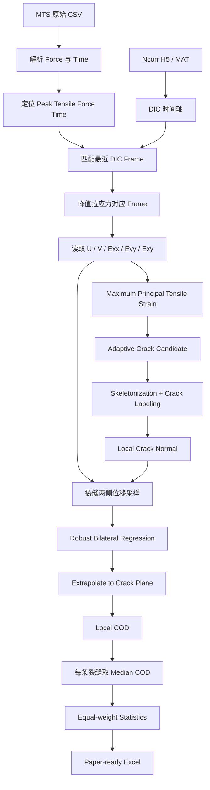
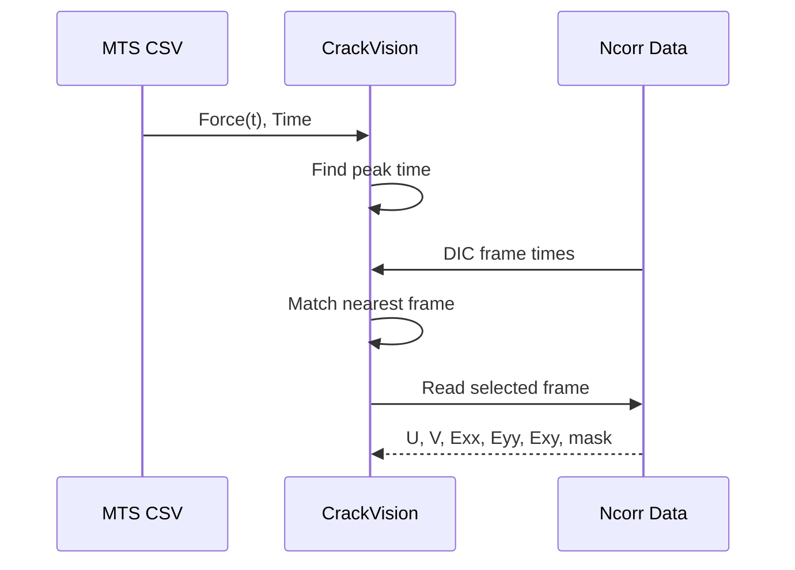
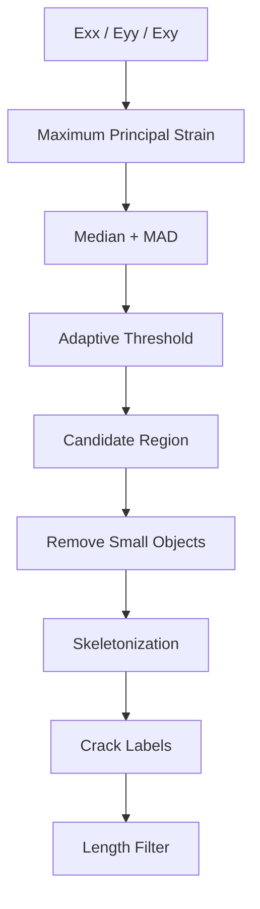
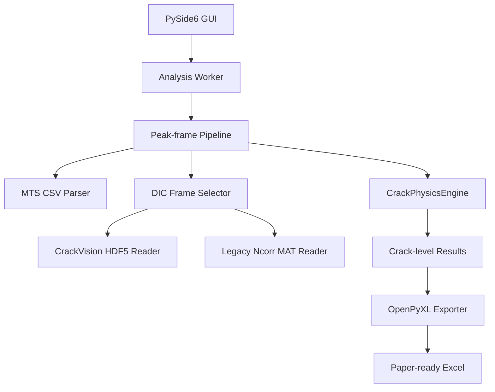
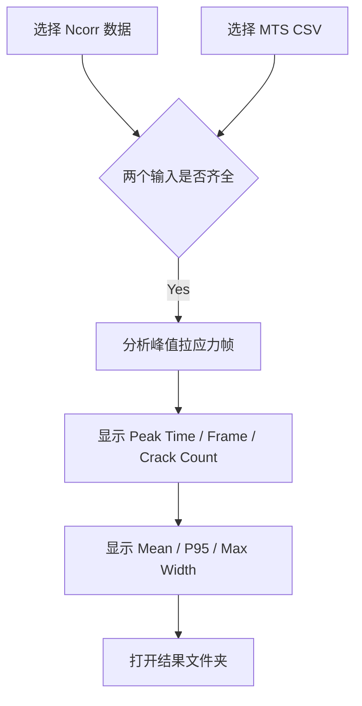

# CrackVision-DIC

<p align="center">
  <strong>面向 ECC / SHCC 单轴拉伸试验的峰值拉应力状态裂缝宽度分析工具</strong><br/>
  <sub>Peak-stress-state Crack Opening Displacement Analysis based on Ncorr DIC + MTS</sub>
</p>

<p align="center">
  
  
  
  
</p>

---

## 项目简介 · Overview

**CrackVision-DIC** 是一个用于 **ECC / SHCC 单轴拉伸 Digital Image Correlation (DIC)** 后处理的专用科研工具。

项目只解决一个明确问题：

> **从 MTS 原始拉伸数据自动定位峰值拉应力时刻，匹配最近的 Ncorr DIC frame，并基于该帧的位移场与应变场提取全部有效裂缝的 Crack Opening Displacement (COD)。**

最终得到：

- 峰值拉应力对应的 DIC frame；
- 峰值状态下全部有效裂缝的代表宽度；
- specimen-level 平均 / 中位 / P95 / 最大裂缝宽度；
- 时间匹配、尺度、阈值等 QA 信息；
- 可直接用于论文整理的 Excel workbook。

当前实验条件假定 **MTS 与图像采集同时开始**：

$$
t_{\mathrm{MTS},0}=t_{\mathrm{DIC},0}=0
$$

因此 GUI 中不再提供人为 synchronization offset。

---

## 整体流程 · Scientific Workflow


```mermaid
flowchart TD
    A[MTS 原始 CSV] --> B[解析 Force 与 Time]
    B --> C[定位 Peak Tensile Force Time]

    D[Ncorr H5 / MAT] --> E[DIC 时间轴]
    C --> F[匹配最近 DIC Frame]
    E --> F

    F --> G[峰值拉应力对应 Frame]
    G --> H[读取 U / V / Exx / Eyy / Exy]

    H --> I[Maximum Principal Tensile Strain]
    I --> J[Adaptive Crack Candidate]
    J --> K[Skeletonization + Crack Labeling]
    K --> L[Local Crack Normal]

    H --> M[裂缝两侧位移采样]
    L --> M
    M --> N[Robust Bilateral Regression]
    N --> O[Extrapolate to Crack Plane]
    O --> P[Local COD]

    P --> Q[每条裂缝取 Median COD]
    Q --> R[Equal-weight Statistics]
    R --> S[Paper-ready Excel]
```

核心计算链可以概括为：

**MTS Peak State → DIC Frame → 最大主拉应变 → Crack Geometry → Displacement Jump → COD**

---

# 1. 峰值拉应力帧选择 · Peak-stress Frame Selection

## 1.1 为什么只需要峰值拉力时刻

对于名义截面积 $A$ 固定的拉伸试件：

$$
\sigma(t)=\frac{F(t)}{A}
$$

因此峰值拉应力与峰值拉力出现在同一时刻：

$$
\underset{t}{\arg\max}\;\sigma(t)
=
\underset{t}{\arg\max}\;F(t)
$$

所以 CrackVision-DIC 在选择目标 DIC frame 时，只需要 MTS 的：

```text
Force
Time
```

不需要额外输入试件截面积。

对于不同 MTS 导出格式，拉伸方向可能记为正值或负值。程序先判断 tension sign $s\in\{-1,+1\}$，再确定峰值时刻：

$$
t_{\mathrm{peak}}
=
\underset{t}{\arg\max}\;[sF(t)]
$$

MTS 在本项目中只负责 **确定 Peak Tensile Stress 对应时刻**，不参与 COD 计算。

## 1.2 峰值时刻与 DIC frame 匹配

设 DIC 帧时间为：

$$
t_0^{\mathrm{DIC}},\;t_1^{\mathrm{DIC}},\;\ldots,\;t_{N-1}^{\mathrm{DIC}}
$$

程序选择距离峰值时刻最近的一帧：

$$
k^*
=
\underset{k}{\arg\min}\;
\left|t_k^{\mathrm{DIC}}-t_{\mathrm{peak}}\right|
$$

时间匹配误差定义为：

$$
\Delta t
=
t_{k^*}^{\mathrm{DIC}}-t_{\mathrm{peak}}
$$

对于当前 **5 s / image** 的采集方式，如果 MTS 与相机同步起始，nearest-frame matching 的绝对误差通常不超过约半个采样间隔。


```mermaid
sequenceDiagram
    participant MTS as MTS CSV
    participant CV as CrackVision
    participant DIC as Ncorr Data

    MTS->>CV: Force(t), Time
    CV->>CV: Find peak time
    DIC->>CV: DIC frame times
    CV->>CV: Match nearest frame
    CV->>DIC: Read selected frame
    DIC-->>CV: U, V, Exx, Eyy, Exy, mask
```

---

# 2. Ncorr 数据接口 · Data Contract

对于新试验，推荐使用 CrackVision 专用的 **compact HDF5 bridge**，而不是直接解析体积很大的 Ncorr `.mat`。

## 2.1 推荐导出方式

完成 Ncorr 的：

```text
DIC Analysis
→ Format Displacements
→ Get Unit Conversion (mm)
→ Calculate Strains
```

之后在 MATLAB 中运行：

```matlab
handles_ncorr = ncorr;
% ... 完成正常 Ncorr 计算 ...

addpath('path/to/CrackVision-DIC/matlab')
export_ncorr_to_crackvision( ...
    handles_ncorr, ...
    'Specimen01_CrackVision.h5', ...
    5);   % 5 s / image
```

已有 Ncorr MAT 也可以转换：

```matlab
export_ncorr_to_crackvision( ...
    'Specimen01.mat', ...
    'Specimen01_CrackVision.h5', ...
    5);
```

## 2.2 HDF5 保存内容

```text
/
├─ fields/
│  ├─ u
│  ├─ v
│  ├─ exx
│  ├─ eyy
│  ├─ exy
│  └─ mask
├─ time_s
└─ attributes
   ├─ coordinate_system = reference
   ├─ strain_measure = Green-Lagrange
   ├─ pixel_size_mm
   ├─ ncorr_spacing_raw
   ├─ dic_step_px
   ├─ dic_point_spacing_mm
   ├─ sampling_interval_s
   └─ numeric_precision
```

位移与应变统一采用 **Reference Configuration**：

```text
plot_u_ref_formatted
plot_v_ref_formatted
plot_exx_ref_formatted
plot_eyy_ref_formatted
plot_exy_ref_formatted
```

这样可以避免不同 configuration 的位移场与应变场混用。

## 2.3 Ncorr spacing 与物理网格间距

Ncorr 原生 `spacing` 按 skipped-pixel count 处理，因此 DIC subset centre step 为：

$$
\Delta p_{\mathrm{DIC}}
=
\mathrm{spacing}_{\mathrm{Ncorr}}+1
$$

若图像尺度为 $p=\mathrm{pixel\_size\_mm}$，则 DIC 网格物理间距为：

$$
\Delta x_{\mathrm{DIC}}
=
p\,\Delta p_{\mathrm{DIC}}
$$

需要区分：

- `pixel_size_mm`：位移 pixel → mm 的尺度；
- `dic_point_spacing_mm`：DIC grid index → physical distance 的尺度。

两者相关，但不是同一个量。

---

# 3. 裂缝定位 · Maximum Principal Tensile Strain

裂缝定位不直接依赖单一 $E_{xx}$ 或 $E_{yy}$，而使用 **Maximum Principal Tensile Strain**。

二维 Green-Lagrange strain tensor 为：

$$
\mathbf{E}=
\begin{bmatrix}
E_{xx} & E_{xy}\\
E_{xy} & E_{yy}
\end{bmatrix}
$$

最大主拉应变：

$$
\varepsilon_1
=
\frac{E_{xx}+E_{yy}}{2}
+
\sqrt{
\left(\frac{E_{xx}-E_{yy}}{2}\right)^2
+E_{xy}^2
}
$$

当前 Ncorr bridge 中，$E_{xy}$ 按 **tensor Green-Lagrange shear component** 处理，而不是 engineering shear strain。

采用 $\varepsilon_1$ 的原因是：ECC / SHCC 裂缝可能水平、竖直或倾斜，最大主拉应变对全局坐标方向更不敏感，更适合进行 crack localization。

---

# 4. 自适应阈值 · Robust Adaptive Threshold

CrackVision-DIC 不使用单一固定阈值直接判定裂缝，而是根据当前峰值帧的应变背景自动计算 threshold。

设有效区域内最大主拉应变为 $\varepsilon_{1,i}$，首先计算：

$$
m=\mathrm{median}(\varepsilon_1)
$$

$$
\mathrm{MAD}
=
\mathrm{median}\left(|\varepsilon_1-m|\right)
$$

robust scale 为：

$$
\hat{\sigma}_r
=
1.4826\,\mathrm{MAD}
$$

原始 threshold：

$$
T_{\mathrm{raw}}
=
m+k\hat{\sigma}_r
$$

当前默认 $k=2.0$。

最终阈值限制为：

$$
T
=
\mathrm{clip}\left(
T_{\mathrm{raw}},
2\times10^{-4},
5\times10^{-2}
\right)
$$

候选 crack region 满足：

$$
\varepsilon_1\ge T
\quad\text{and}\quad
\varepsilon_1>0
$$

随后执行 small-object removal、skeletonization 和 connected-component labeling。

当前默认：

```text
min_crack_area_points = 4
min_crack_length_mm   = 0.15 mm
```


```mermaid
flowchart TD
    A[Exx / Eyy / Exy] --> B[Maximum Principal Strain]
    B --> C[Median + MAD]
    C --> D[Adaptive Threshold]
    D --> E[Candidate Region]
    E --> F[Remove Small Objects]
    F --> G[Skeletonization]
    G --> H[Crack Labels]
    H --> I[Length Filter]
```

---

# 5. 局部裂缝坐标系 · Local Crack Coordinate System

对于每个 crack skeleton point，程序根据邻域 skeleton coordinates 估计局部切向方向。

设单位切向量为：

$$
\mathbf{t}=
\begin{bmatrix}
t_x\\t_y
\end{bmatrix}
$$

局部单位法向量为：

$$
\mathbf{n}=
\begin{bmatrix}
-t_y\\t_x
\end{bmatrix}
$$

因此裂缝宽度沿 **local crack normal** 测量，而不是机械地沿全局 $x$ 或 $y$ 方向测量。

---

# 6. COD 计算 · Bilateral Displacement Regression

> **应变场负责“找裂缝”，裂缝宽度本身来自 displacement discontinuity，而不是高应变带的视觉厚度。**

对 DIC displacement vector：

$$
\mathbf{u}=
\begin{bmatrix}
u\\v
\end{bmatrix}
$$

法向位移分量为：

$$
u_n
=
\mathbf{u}\cdot\mathbf{n}
=
un_x+vn_y
$$

切向位移分量为：

$$
u_t
=
\mathbf{u}\cdot\mathbf{t}
=
-un_y+vn_x
$$

其中 $u_n$ 用于 Crack Opening Displacement，$u_t$ 作为 tangential slip diagnostic。

## 6.1 裂缝两侧采样

每个 skeleton point 沿 crack normal 两侧采样，默认物理距离范围：

$$
0.15\;\mathrm{mm}
\le |s| \le
0.75\;\mathrm{mm}
$$

当前默认参数：

```text
samples_per_side   = 7
min_valid_per_side = 3
```

## 6.2 双侧线性拟合

裂缝正、负两侧分别拟合 normal displacement：

$$
u_n^+(s)=a_+s+b_+
$$

$$
u_n^-(s)=a_-s+b_-
$$

拟合过程中使用 residual MAD 进行 robust filtering，默认保留规则等价于：

$$
|r_i-\tilde r|
\le
3.5\hat{\sigma}_r
$$

从而降低少量 DIC 异常点对 COD 的影响。

## 6.3 外推到 Crack Plane

在 crack plane 上 $s=0$：

$$
u_n^+(0)=b_+
$$

$$
u_n^-(0)=b_-
$$

因此 local COD 为：

$$
\mathrm{COD}
=
|b_+-b_-|
$$

随后依据 Ncorr displacement scale 转换为 mm / μm。

```mermaid
flowchart TD
    A[Crack Skeleton Point] --> B[Estimate Local Normal]
    B --> C[Sample Positive Side]
    B --> D[Sample Negative Side]
    C --> E[Project U,V onto Normal]
    D --> F[Project U,V onto Normal]
    E --> G[Robust Line Fit]
    F --> H[Robust Line Fit]
    G --> I[Extrapolate to s = 0]
    H --> I
    I --> J[COD = abs(b+ - b-)]
```

---

# 7. 每条裂缝的代表宽度 · Crack-level Width

一条物理裂缝通常包含多个有效 local COD：

$$
w_{j,1},\;w_{j,2},\;\ldots,\;w_{j,m_j}
$$

其中 $j$ 为 Crack ID。

当前要求每条裂缝至少有 3 个有效 COD samples：

$$
m_j\ge3
$$

每条裂缝的代表宽度定义为：

$$
w_j
=
\mathrm{median}_i\left(w_{j,i}\right)
$$

也就是：

> **一条裂缝 = 一个代表宽度；代表宽度 = 该裂缝沿线所有有效 local COD 的中位数。**

`02_裂缝明细` 中的 **代表宽度 (μm)** 就是 $w_j$。

---

# 8. 试件级统计 · Equal-weight Specimen Statistics

若峰值拉应力 frame 中识别出 $N_c$ 条有效裂缝，其代表宽度为：

$$
w_1,\;w_2,\;\ldots,\;w_{N_c}
$$

每条裂缝统计权重完全相同，不因 crack length 或 COD sample count 不同而改变。

平均裂缝宽度：

$$
\bar w
=
\frac{1}{N_c}
\sum_{j=1}^{N_c}w_j
$$

同时输出：

$$
w_{50}=\mathrm{median}(w_j)
$$

$$
w_{95}=Q_{0.95}(w_j)
$$

$$
w_{\max}=\max(w_j)
$$

对应软件中的 paper-facing metrics：

```text
Crack_width_mean_um
Crack_width_median_um
Crack_width_95_um
Crack_width_max_um
```

---

# 9. 默认科学参数 · Scientific Parameters

| 模块 | 参数 | 默认值 | 含义 |
|---|---|---:|---|
| Detection | `threshold_k` | 2.0 | Median + k × robust scale |
| Detection | `min_tensile_strain` | 0.0002 | threshold 下限 |
| Detection | `max_threshold` | 0.05 | threshold 上限 |
| Detection | `min_crack_area_points` | 4 | 最小候选区面积 |
| Detection | `min_crack_length_mm` | 0.15 mm | 最短有效 skeleton |
| COD | `near_mm` | 0.15 mm | 最近采样距离 |
| COD | `far_mm` | 0.75 mm | 最远采样距离 |
| COD | `samples_per_side` | 7 | 每侧请求采样点数 |
| COD | `min_valid_per_side` | 3 | 每侧最少有效点数 |
| COD | `min_samples_per_crack` | 3 | 每条裂缝最少 local COD 数 |
| COD | `min_width_mm` | 0.001 mm | 代表宽度下限 |
| COD | `max_width_mm` | 2.0 mm | local COD 上限 |
| Robust Fit | `robust_sigma` | 3.5 | residual outlier 阈值 |

这些参数位于：

```text
config/default.yaml
```

---

# 10. 软件架构 · Architecture


```mermaid
flowchart TD
    GUI[PySide6 GUI] --> WORKER[Analysis Worker]
    WORKER --> PIPELINE[Peak-frame Pipeline]

    PIPELINE --> MTS[MTS CSV Parser]
    PIPELINE --> INPUT[DIC Frame Selector]

    INPUT --> H5[CrackVision HDF5 Reader]
    INPUT --> MAT[Legacy Ncorr MAT Reader]

    PIPELINE --> PHYSICS[CrackPhysicsEngine]
    PHYSICS --> RESULT[Crack-level Results]
    RESULT --> EXPORT[OpenPyXL Exporter]
    EXPORT --> XLSX[Paper-ready Excel]
```

核心原则：

- GUI 不处理科学计算；
- Worker 不实现 COD algorithm；
- Reader 不判断裂缝；
- Physics 不依赖 Qt / Excel；
- Export 只负责结果呈现。

---

# 11. GUI 使用 · Minimal Workflow

GUI 只保留三个操作：

```text
1. 选择 Ncorr H5 / MAT
2. 选择对应 MTS CSV
3. 点击「分析峰值拉应力帧」
```


```mermaid
flowchart TD
    A[选择 Ncorr 数据] --> C{两个输入是否齐全}
    B[选择 MTS CSV] --> C
    C -->|Yes| D[分析峰值拉应力帧]
    D --> E[显示 Peak Time / Frame / Crack Count]
    E --> F[显示 Mean / P95 / Max Width]
    F --> G[打开结果文件夹]
```

结果自动保存到：

```text
<Ncorr 文件夹>/CrackVision_Output/<specimen>_CrackVision.xlsx
```

---

# 12. Excel 输出 · Paper-ready Workbook

每个 specimen 只生成一个 Excel workbook：

```text
<specimen>_CrackVision.xlsx
├─ 01_结果汇总
├─ 02_裂缝明细
└─ 03_质量检查
```

## 12.1 `01_结果汇总`

用于论文结果快速查看：

```text
峰值拉力
峰值时刻
DIC frame
时间匹配误差
有效裂缝数
平均裂缝宽度
中位裂缝宽度
P95 裂缝宽度
最大裂缝宽度
COD status
```

并自动绘制峰值拉应力状态下各裂缝代表宽度图。

## 12.2 `02_裂缝明细`

每一行对应一条有效裂缝：

```text
裂缝编号
裂缝长度 (mm)
代表宽度 (μm)
COD 有效点数
拟合 R² 中位数
```

论文中如果需要画 crack-width distribution，直接使用 **代表宽度 (μm)** 列。

## 12.3 `03_质量检查`

保留必要 QA 信息，例如：

```text
COD status
Peak Force / Peak Time
Selected DIC Frame
Frame Match Error
Pixel Scale
DIC Grid Spacing
Valid Fraction
Principal-strain Threshold
Candidate / Skeleton Points
Metadata Source
```

---

# 13. 安装与运行 · Installation

推荐 Python 3.10+。

```bash
python -m venv .venv

# Windows
.venv\Scripts\activate

pip install -r requirements.txt
python main.py
```

---

# 14. 项目结构 · Project Structure

```text
CrackVision-DIC/
├─ main.py
├─ config/
│  └─ default.yaml
├─ matlab/
│  └─ export_ncorr_to_crackvision.m
├─ src/
│  ├─ core/
│  │  ├─ config.py
│  │  ├─ mts.py
│  │  ├─ input.py
│  │  ├─ io_bridge.py
│  │  ├─ io_ncorr.py
│  │  ├─ models.py
│  │  ├─ physics.py
│  │  ├─ pipeline.py
│  │  └─ export.py
│  └─ gui/
│     ├─ main_window.py
│     └─ worker.py
└─ tests/
```

---

# 15. 方法定义 · Method Summary

CrackVision-DIC 当前采用的完整定义为：

$$
t_{\mathrm{peak}}
=
\underset{t}{\arg\max}\;[sF(t)]
$$

$$
k^*
=
\underset{k}{\arg\min}\;
\left|t_k^{\mathrm{DIC}}-t_{\mathrm{peak}}\right|
$$

$$
\varepsilon_1
=
\frac{E_{xx}+E_{yy}}{2}
+
\sqrt{
\left(\frac{E_{xx}-E_{yy}}{2}\right)^2+E_{xy}^2
}
$$

$$
\mathrm{COD}_{j,i}
=
|b_{j,i}^{+}-b_{j,i}^{-}|
$$

$$
w_j
=
\mathrm{median}_i(\mathrm{COD}_{j,i})
$$

$$
\bar w
=
\frac{1}{N_c}\sum_{j=1}^{N_c}w_j
$$

即：

> **MTS 定位峰值状态，Maximum Principal Tensile Strain 定位裂缝，Ncorr U/V 位移场计算 COD，每条裂缝以 median local COD 作为代表宽度，试件级统计按裂缝等权。**

---

## Scope

项目当前**不包含**：

- image-based crack segmentation；
- 通过图像像素厚度估算 crack width；
- MTS 全曲线 dashboard；
- 多模式 report system；
- multiprocessing / temporary-file pipeline；
- 与峰值拉应力状态无关的冗余分析模式。

CrackVision-DIC 的定位始终保持为：

> **一个专门服务于 ECC / SHCC 峰值拉应力状态 DIC-COD 裂缝宽度分析的轻量科研工具。**
