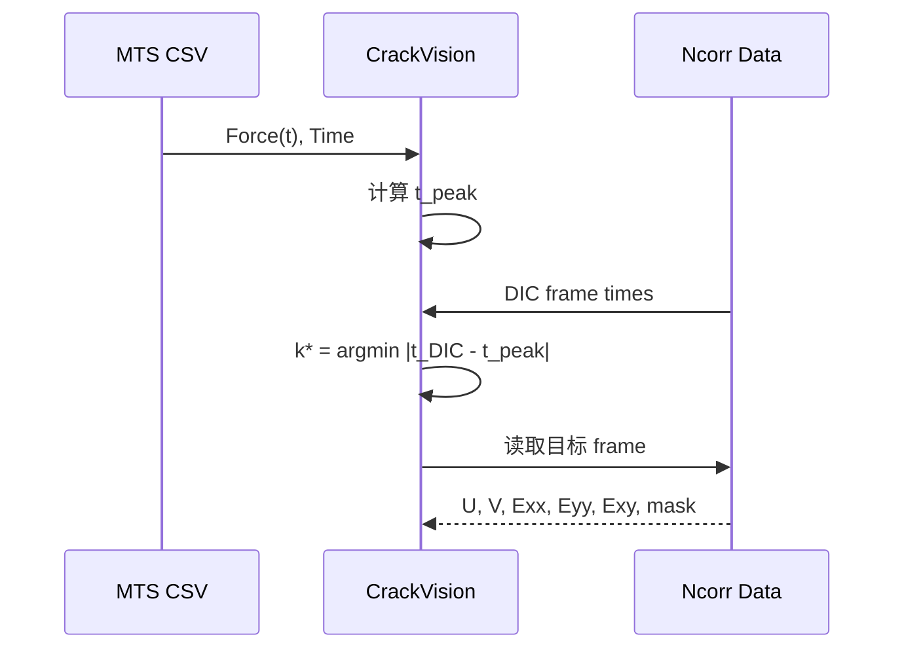
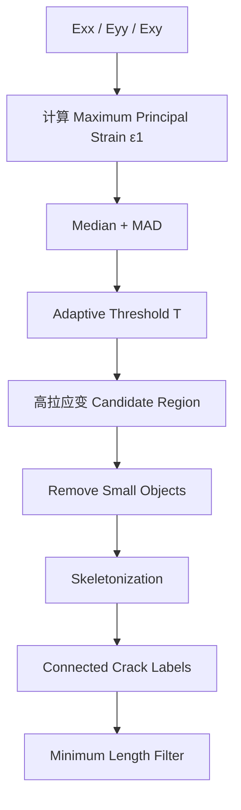
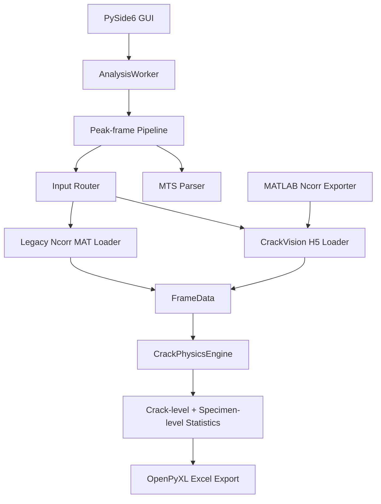
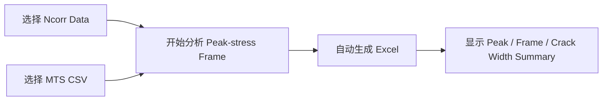

# CrackVision-DIC

<p align="center">
  <strong>面向 ECC / SHCC 单轴拉伸试验的峰值拉应力状态裂缝宽度分析工具</strong><br/>
  <sub>Peak-stress-state Crack Opening Displacement Analysis based on Ncorr DIC + MTS</sub>
</p>

<p align="center">
  
  
  
  
</p>

---

## 项目简介 · Overview

**CrackVision-DIC** 是一个专门用于 **ECC / SHCC 单轴拉伸 Digital Image Correlation (DIC)** 后处理的科研工具。

它不做通用 DIC、不做图像裂缝分割、不做复杂 MTS dashboard，也不试图覆盖所有断裂力学场景。当前项目只解决一个明确的问题：

> **从 MTS 原始拉伸数据自动定位峰值拉应力时刻，匹配最近的 Ncorr DIC 帧，并基于该帧的位移场与应变场提取全部有效裂缝的 Crack Opening Displacement (COD)。**

最终输出包括：

- 峰值拉应力对应的 DIC frame；
- 峰值状态下全部有效裂缝的代表宽度；
- specimen-level 平均 / 中位 / P95 / 最大裂缝宽度；
- 用于结果追溯的 QA 信息；
- 可直接用于论文整理的 Excel workbook。

本项目当前实验条件假定：

\[
t_{\mathrm{MTS},0}=t_{\mathrm{DIC},0}=0
\]

即 **MTS 采集与图像采集同时开始**，因此 GUI 中不再提供人为时间偏移输入。

---

## 整体流程 · Scientific Workflow


```mermaid
flowchart LR
    A[MTS 原始 CSV] --> B[解析 Force 与 Time]
    B --> C[定位 Peak Tensile Force Time]

    D[Ncorr H5 / MAT] --> E[DIC 时间轴]
    C --> F[Nearest-frame Matching]
    E --> F

    F --> G[峰值拉应力对应 DIC Frame]
    G --> H[U / V / Exx / Eyy / Exy]

    H --> I[Maximum Principal Tensile Strain]
    I --> J[自适应裂缝候选区]
    J --> K[Skeletonization + Crack Labeling]
    K --> L[局部 Crack Tangent / Normal]

    H --> M[裂缝两侧位移采样]
    L --> M
    M --> N[Robust Bilateral Regression]
    N --> O[外推至 Crack Plane]
    O --> P[Local COD]

    P --> Q[每条裂缝取 Median COD]
    Q --> R[Equal-weight Specimen Statistics]
    R --> S[论文级 Excel 输出]
```

整个核心计算链可以简化为：

\[
\boxed{
\text{MTS Peak State}
\rightarrow
\text{DIC Frame}
\rightarrow
\varepsilon_1
\rightarrow
\text{Crack Geometry}
\rightarrow
\Delta\mathbf{u}\cdot\mathbf{n}
\rightarrow
\mathrm{COD}
}
\]

---

# 1. 峰值拉应力帧选择 · Peak-stress Frame Selection

## 1.1 为什么可以直接用峰值拉力时刻

对名义截面积 \(A\) 固定的拉伸试件：

\[
\sigma(t)=\frac{F(t)}{A}
\]

因此：

\[
\operatorname*{arg\,max}_t\sigma(t)
=
\operatorname*{arg\,max}_tF(t)
\]

也就是说，**峰值拉应力 Peak Tensile Stress 与峰值拉力 Peak Tensile Force 出现在同一时刻**。

所以 CrackVision-DIC 在“选择目标 DIC frame”这一步只需要 MTS 的：

```text
Force
Time
```

而不需要额外输入试件截面积。

对于不同 MTS 导出格式，拉伸力可能记为正值或负值，因此程序先判断 tension sign \(s\in\{-1,+1\}\)，再计算：

\[
\boxed{
t_{\mathrm{peak}}
=
\operatorname*{arg\,max}_t[sF(t)]
}
\]

MTS 在本项目中的作用仅仅是**确定峰值时刻**，并不参与裂缝宽度 COD 的计算。

## 1.2 峰值时刻与 DIC frame 匹配

假设 DIC 时间轴为：

\[
\left\{
t_0^{\mathrm{DIC}},
t_1^{\mathrm{DIC}},
\ldots,
t_{N-1}^{\mathrm{DIC}}
\right\}
\]

程序选择最接近 MTS 峰值时刻的帧：

\[
\boxed{
k^*
=
\operatorname*{arg\,min}_k
\left|t_k^{\mathrm{DIC}}-t_{\mathrm{peak}}\right|
}
\]

并记录时间匹配误差：

\[
\boxed{
\Delta t
=
t_{k^*}^{\mathrm{DIC}}-t_{\mathrm{peak}}
}
\]

对于当前 **5 s / image** 的采集方式，只要 MTS 与相机同步起始，理论上 nearest-frame matching 的误差通常不会超过半个采样间隔附近。


```mermaid
sequenceDiagram
    participant MTS as MTS CSV
    participant CV as CrackVision
    participant DIC as Ncorr Data

    MTS->>CV: Force(t), Time
    CV->>CV: 计算 t_peak
    DIC->>CV: DIC frame times
    CV->>CV: k* = argmin |t_DIC - t_peak|
    CV->>DIC: 读取目标 frame
    DIC-->>CV: U, V, Exx, Eyy, Exy, mask
```

---

# 2. Ncorr 数据接口 · Data Contract

对于新试验，推荐使用 CrackVision 专用的 **compact HDF5 bridge**，而不是让 Python 直接解析体积很大的原始 Ncorr `.mat`。

## 2.1 推荐导出方式

完成 Ncorr 的：

```text
DIC Analysis
→ Format Displacements
→ Get Unit Conversion（mm）
→ Calculate Strains
```

之后在 MATLAB 中运行：

```matlab
handles_ncorr = ncorr;
% ... 正常完成 Ncorr 计算 ...

addpath('path/to/CrackVision-DIC/matlab')
export_ncorr_to_crackvision( ...
    handles_ncorr, ...
    'Specimen01_CrackVision.h5', ...
    5);   % 5 s / image
```

已有的大型 Ncorr MAT 也可以转换：

```matlab
export_ncorr_to_crackvision( ...
    'Specimen01.mat', ...
    'Specimen01_CrackVision.h5', ...
    5);
```

## 2.2 HDF5 中保存什么

只保留裂缝宽度分析真正需要的数据：

```text
/
├─ fields/
│  ├─ u
│  ├─ v
│  ├─ exx
│  ├─ eyy
│  ├─ exy
│  └─ mask
├─ time_s
└─ attributes
   ├─ coordinate_system = reference
   ├─ strain_measure = Green-Lagrange
   ├─ pixel_size_mm
   ├─ ncorr_spacing_raw
   ├─ dic_step_px
   ├─ dic_point_spacing_mm
   ├─ sampling_interval_s
   └─ numeric_precision
```

位移与应变统一采用 **Reference Configuration**：

```text
plot_u_ref_formatted
plot_v_ref_formatted
plot_exx_ref_formatted
plot_eyy_ref_formatted
plot_exy_ref_formatted
```

这样可以避免把 reference displacement 与其他 configuration 的 strain 混合使用。

## 2.3 Ncorr spacing 与物理网格间距

Ncorr 原生 `spacing` 按 skipped-pixel count 处理，因此 DIC subset centre 的步长为：

\[
\boxed{
\Delta p_{\mathrm{DIC}}
=
\mathrm{spacing}_{\mathrm{Ncorr}}+1
}
\]

若图像物理尺度为：

\[
p=\mathrm{pixel\_size\_mm}
\quad [\mathrm{mm/pixel}]
\]

则一个 DIC grid index 对应的物理距离：

\[
\boxed{
\Delta x_{\mathrm{DIC}}
=p\,\Delta p_{\mathrm{DIC}}
\quad [\mathrm{mm/point}]
}
\]

这里必须区分：

- `pixel_size_mm`：位移 pixel → mm 的尺度；
- `dic_point_spacing_mm`：DIC 网格索引 → 物理位置的尺度。

两者相关，但不能混为一个量。

---

# 3. 裂缝定位 · Maximum Principal Tensile Strain

裂缝位置不是直接由 \(E_{xx}\) 单一分量决定，而是使用 **Maximum Principal Tensile Strain**。

对二维 Green-Lagrange strain tensor：

\[
\mathbf{E}
=
\begin{bmatrix}
E_{xx} & E_{xy}\\
E_{xy} & E_{yy}
\end{bmatrix}
\]

最大主拉应变为：

\[
\boxed{
\varepsilon_1
=
\frac{E_{xx}+E_{yy}}{2}
+
\sqrt{
\left(\frac{E_{xx}-E_{yy}}{2}\right)^2
+E_{xy}^{2}
}
}
\]

当前 Ncorr bridge 中 \(E_{xy}\) 按 **tensor Green-Lagrange shear component** 处理，而不是 engineering shear strain。

采用最大主拉应变的原因是：裂缝可能水平、竖直或倾斜，单独使用 \(E_{xx}\) 或 \(E_{yy}\) 会对坐标方向敏感，而 \(\varepsilon_1\) 更适合做 orientation-independent crack localization。

---

# 4. 自适应裂缝阈值 · Robust Adaptive Threshold

CrackVision-DIC 不使用单一固定应变阈值直接判裂缝，而是根据当前峰值帧的背景应变自适应计算 threshold。

设有效区域内的最大主拉应变为 \(\{\varepsilon_{1,i}\}\)，首先计算：

\[
m=\operatorname{median}(\varepsilon_1)
\]

\[
\operatorname{MAD}
=
\operatorname{median}\left(
|\varepsilon_1-m|
\right)
\]

对应 robust scale：

\[
\hat\sigma_r
=1.4826\,\operatorname{MAD}
\]

原始 threshold：

\[
T_{\mathrm{raw}}
=m+k\hat\sigma_r
\]

当前默认：

\[
k=2.0
\]

最终 threshold 被限制在：

\[
\boxed{
T
=
\operatorname{clip}
\left(
T_{\mathrm{raw}},
2\times10^{-4},
5\times10^{-2}
\right)
}
\]

候选 crack region 满足：

\[
\varepsilon_1\ge T,
\qquad
\varepsilon_1>0
\]

随后执行 small-object removal、skeletonization 和 connected-component labeling。

当前默认：

```text
min_crack_area_points = 4
min_crack_length_mm   = 0.15 mm
```


```mermaid
flowchart TD
    A[Exx / Eyy / Exy] --> B[计算 Maximum Principal Strain ε1]
    B --> C[Median + MAD]
    C --> D[Adaptive Threshold T]
    D --> E[高拉应变 Candidate Region]
    E --> F[Remove Small Objects]
    F --> G[Skeletonization]
    G --> H[Connected Crack Labels]
    H --> I[Minimum Length Filter]
```

---

# 5. 局部裂缝坐标系 · Local Crack Coordinate System

对每一个 crack skeleton point，程序根据邻域 skeleton coordinates 估计局部切向方向。

设单位切向量：

\[
\mathbf{t}
=
\begin{bmatrix}
t_x\\t_y
\end{bmatrix},
\qquad
\|\mathbf{t}\|=1
\]

局部单位法向量取为：

\[
\boxed{
\mathbf{n}
=
\begin{bmatrix}
-t_y\\t_x
\end{bmatrix}
}
\]

因此裂缝宽度始终沿**局部 crack normal** 测量，而不是机械地沿全局 \(x\) 或 \(y\) 方向测量。

这一步对于 ECC / SHCC 的斜裂缝尤其重要。

---

# 6. COD 计算 · Bilateral Displacement Regression

这里需要明确：

> **应变场用于“找裂缝”，裂缝宽度本身来自 displacement discontinuity，而不是高应变带的视觉厚度。**

对 DIC displacement vector：

\[
\mathbf{u}
=
\begin{bmatrix}
u\\v
\end{bmatrix}
\]

沿局部法向和切向投影得到：

\[
\boxed{
u_n
=
\mathbf{u}\cdot\mathbf{n}
=
un_x+vn_y
}
\]

\[
\boxed{
u_t
=
\mathbf{u}\cdot\mathbf{t}
=
-un_y+vn_x
}
\]

其中 \(u_n\) 用于 Crack Opening Displacement，\(u_t\) 作为 tangential slip diagnostic。

## 6.1 裂缝两侧采样 · Bilateral Sampling

对于每个 skeleton point，在 crack normal 两侧分别采样：

\[
0.15\ \mathrm{mm}
\le |s| \le
0.75\ \mathrm{mm}
\]

当前默认：

```text
samples_per_side   = 7
min_valid_per_side = 3
```

不是简单取裂缝左右各一个点直接相减，而是利用两侧多个 DIC displacement samples 构建局部位移趋势。

## 6.2 两侧线性拟合 · Crack-face Regression

正侧与负侧分别拟合：

\[
u_n^{+}(s)=a_{+}s+b_{+}
\]

\[
u_n^{-}(s)=a_{-}s+b_{-}
\]

为降低异常 DIC point 对结果的影响，拟合过程中使用 residual MAD 进行 iterative robust filtering。

设 residual 为 \(r_i\)：

\[
\tilde r
=
\operatorname{median}(r_i)
\]

\[
\hat\sigma_r
=
1.4826\operatorname{median}
\left(|r_i-\tilde r|\right)
\]

当前默认保留条件：

\[
\boxed{
|r_i-\tilde r|
\le
3.5\hat\sigma_r
}
\]

## 6.3 外推到裂缝面 · Crack-plane Extrapolation

在 crack plane：

\[
s=0
\]

因此两侧拟合值为：

\[
u_n^{+}(0)=b_{+}
\]

\[
u_n^{-}(0)=b_{-}
\]

局部 COD：

\[
\boxed{
\mathrm{COD}
=
\left|b_{+}-b_{-}\right|
}
\]

再根据 `pixel_size_mm` 转换为真实物理宽度。

```mermaid
flowchart LR
    A[Crack Skeleton Point] --> B[估计 Local Normal n]
    B --> C[+n 侧多点采样]
    B --> D[-n 侧多点采样]
    C --> E[U,V 投影到 Normal]
    D --> F[U,V 投影到 Normal]
    E --> G[Robust Fit +]
    F --> H[Robust Fit -]
    G --> I[Extrapolate to s=0]
    H --> I
    I --> J[COD = |b+ - b-|]
```

---

# 7. 每条裂缝的代表宽度 · Crack-level Width

一条真实裂缝沿长度方向通常会得到多个有效 local COD：

\[
\left\{
w_{j,1},
w_{j,2},
\ldots,
w_{j,m_j}
\right\}
\]

其中 \(j\) 表示 Crack ID。

当前要求：

\[
m_j\ge3
\]

即一条裂缝至少具有 3 个有效 COD samples 才进入最终 crack-level statistics。

每条裂缝的代表宽度定义为：

\[
\boxed{
w_j
=
\operatorname{median}_i
\left(w_{j,i}\right)
}
\]

也就是：

> **Representative Crack Width = Median Local COD**

这样可以避免用一个偶然的局部测点代表整条裂缝。

当前宽度接受范围：

\[
1\ \mu\mathrm{m}
\le w_j\le
2\ \mathrm{mm}
\]

Excel 的 `02_裂缝明细` 中，`代表宽度 (μm)` 就是 \(w_j\)。

---

# 8. 试件级统计 · Equal-weight Specimen Statistics

假设峰值拉应力帧中最终接受 \(N_c\) 条裂缝：

\[
\left\{
w_1,w_2,\ldots,w_{N_c}
\right\}
\]

CrackVision-DIC 的 specimen-level statistics 采用**每条裂缝等权**。

也就是说，无论某条裂缝更长、拥有更多 COD samples，都不会在试件平均值中获得更大的统计权重。

平均裂缝宽度：

\[
\boxed{
\bar w
=
\frac{1}{N_c}
\sum_{j=1}^{N_c}w_j
}
\]

中位裂缝宽度：

\[
\boxed{
w_{50}
=
\operatorname{median}(w_j)
}
\]

P95：

\[
\boxed{
w_{95}
=
Q_{0.95}(w_j)
}
\]

最大裂缝宽度：

\[
\boxed{
w_{\max}
=
\max_j(w_j)
}
\]

论文中最直接对应的输出字段为：

```text
Crack_width_mean_um
Crack_width_median_um
Crack_width_95_um
Crack_width_max_um
```

其中如果正文写“average crack width”，推荐对应：

```text
Crack_width_mean_um
```

---

# 9. 当前默认科学参数 · Scientific Parameters

| 模块 | Parameter | 当前默认值 | 含义 |
|---|---|---:|---|
| DIC | `sampling_interval_s` | 5.0 s | 图像采样间隔 fallback |
| Detection | `threshold_k` | 2.0 | Median + MAD threshold multiplier |
| Detection | `min_tensile_strain` | 0.0002 | threshold 下限 |
| Detection | `max_threshold` | 0.05 | threshold 上限 |
| Detection | `min_crack_area_points` | 4 | 最小候选区域 |
| Detection | `min_crack_length_mm` | 0.15 mm | 最短有效 crack skeleton |
| Geometry | `normal_radius_points` | 4 | 局部方向估计邻域 |
| COD | `near_mm` | 0.15 mm | 双侧采样最近距离 |
| COD | `far_mm` | 0.75 mm | 双侧采样最远距离 |
| COD | `samples_per_side` | 7 | 每侧请求 sample 数 |
| COD | `min_valid_per_side` | 3 | 每侧最少有效点数 |
| COD | `min_samples_per_crack` | 3 | 每条裂缝最少 COD 数 |
| COD | `min_width_mm` | 0.001 mm | 代表宽度下限 |
| COD | `max_width_mm` | 2.0 mm | COD 上限 |
| Robust Fit | `robust_sigma` | 3.5 | residual MAD filter |

这些参数全部集中在：

```text
config/default.yaml
```

---

# 10. 软件架构 · Architecture


```mermaid
flowchart TB
    UI[PySide6 GUI] --> WK[AnalysisWorker]
    WK --> PL[Peak-frame Pipeline]

    PL --> MTS[MTS Parser]
    PL --> IN[Input Router]

    IN --> H5[CrackVision H5 Loader]
    IN --> MAT[Legacy Ncorr MAT Loader]

    H5 --> FD[FrameData]
    MAT --> FD

    FD --> PHY[CrackPhysicsEngine]
    PHY --> SUM[Crack-level + Specimen-level Statistics]
    SUM --> XLSX[OpenPyXL Excel Export]

    MATLAB[MATLAB Ncorr Exporter] --> H5
```

项目保持明确分层：

```text
Input
  ↓
FrameData
  ↓
Physics
  ↓
Statistics
  ↓
Excel
```

GUI 只负责交互，不负责科学计算；MTS 只负责 peak-state selection；COD 只由 Ncorr displacement field 决定。

---

# 11. GUI / UX

当前主界面只保留实际实验工作流需要的三个操作：

```text
1. 选择 Ncorr H5 / MAT
2. 选择对应 MTS CSV
3. 点击「分析峰值拉应力帧」
```


```mermaid
flowchart LR
    A[选择 Ncorr Data] --> C[开始分析 Peak-stress Frame]
    B[选择 MTS CSV] --> C
    C --> D[自动生成 Excel]
    D --> E[显示 Peak / Frame / Crack Width Summary]
```

结果自动保存到：

```text
<Ncorr 数据所在文件夹>/
└─ CrackVision_Output/
   └─ <Specimen>_CrackVision.xlsx
```

界面不会再暴露不必要的：

```text
手动同步 offset
输出目录选择
尺度输入
复杂 dashboard
全帧分析模式
调试日志面板
多种 competing analysis modes
```

---

# 12. Excel 输出 · Paper-ready Workbook

每个试件生成一个 Excel：

```text
<Specimen>_CrackVision.xlsx
├─ 01_结果汇总
├─ 02_裂缝明细
└─ 03_质量检查
```

## 12.1 `01_结果汇总`

用于快速获取论文主结果：

```text
峰值拉力
峰值时刻
选中 DIC Frame
时间匹配误差
有效裂缝数
平均裂缝宽度
中位裂缝宽度
P95 裂缝宽度
最大裂缝宽度
COD 状态
```

并自动生成峰值帧各裂缝代表宽度 chart。

## 12.2 `02_裂缝明细`

一行对应一条 accepted crack：

| 裂缝编号 | 裂缝长度 (mm) | 代表宽度 (μm) | COD 有效点数 | 拟合 R² 中位数 |
|---:|---:|---:|---:|---:|
| 1 | ... | ... | ... | ... |
| 2 | ... | ... | ... | ... |

其中：

```text
代表宽度 (μm)
```

就是该裂缝的：

\[
\operatorname{median}(\mathrm{Local\ COD})
\]

如果要画峰值状态下的 crack-width distribution，优先使用这一列。

## 12.3 `03_质量检查`

保留科研结果追溯真正需要的信息：

```text
COD status
MTS peak force / time
selected DIC frame / time
frame-match error
pixel scale
dic step / grid spacing
valid fraction
principal-strain threshold
candidate points
skeleton points
metadata source
```

---

# 13. 安装与运行 · Installation

推荐 Python 3.10+。

```bash
python -m venv .venv
```

Windows：

```bash
.venv\Scripts\activate
```

安装依赖：

```bash
pip install -r requirements.txt
```

启动：

```bash
python main.py
```

开发 / 测试依赖：

```bash
pip install -r requirements-dev.txt
python -m pytest
```

---

# 14. 项目结构 · Project Structure

```text
CrackVision-DIC/
├─ main.py
├─ config/
│  └─ default.yaml
├─ matlab/
│  └─ export_ncorr_to_crackvision.m
├─ src/
│  ├─ core/
│  │  ├─ config.py
│  │  ├─ mts.py
│  │  ├─ input.py
│  │  ├─ io_bridge.py
│  │  ├─ io_ncorr.py
│  │  ├─ models.py
│  │  ├─ physics.py
│  │  ├─ pipeline.py
│  │  └─ export.py
│  └─ gui/
│     ├─ main_window.py
│     └─ worker.py
└─ tests/
```

---

# 15. 方法总结 · Method Summary

CrackVision-DIC 当前的核心数学定义可以概括为：

\[
\boxed{
\begin{aligned}
t_{\mathrm{peak}}
&=\operatorname*{arg\,max}_t[sF(t)] \\

k^*
&=\operatorname*{arg\,min}_k
\left|t_k^{\mathrm{DIC}}-t_{\mathrm{peak}}\right| \\

\varepsilon_1
&=\frac{E_{xx}+E_{yy}}{2}
+\sqrt{
\left(\frac{E_{xx}-E_{yy}}{2}\right)^2+E_{xy}^2
} \\

\mathrm{COD}_{j,i}
&=\left|b_{j,i}^{+}-b_{j,i}^{-}\right| \\

w_j
&=\operatorname{median}_i(\mathrm{COD}_{j,i}) \\

\bar w
&=\frac{1}{N_c}\sum_{j=1}^{N_c}w_j
\end{aligned}
}
\]

其中：

- \(t_{\mathrm{peak}}\)：MTS 峰值拉应力 / 拉力时刻；
- \(k^*\)：最接近峰值时刻的 DIC frame；
- \(\varepsilon_1\)：Maximum Principal Tensile Strain；
- \(\mathrm{COD}_{j,i}\)：第 \(j\) 条裂缝第 \(i\) 个局部 COD；
- \(w_j\)：第 \(j\) 条裂缝的 representative crack width；
- \(\bar w\)：峰值拉应力状态下 specimen average crack width。

---

## Project Scope

CrackVision-DIC 当前明确**不包含**：

- image-based crack segmentation；
- 直接从照片像素宽度估算裂缝宽度；
- MTS 全曲线 dashboard；
- 多试件 batch reporting system；
- multiprocessing / temp-file pipeline；
- 多套互相竞争的裂缝宽度算法。

项目保持单一目标：

> **Peak Tensile Stress State → Ncorr DIC → Crack-wise COD → Equal-weight Crack Statistics**
