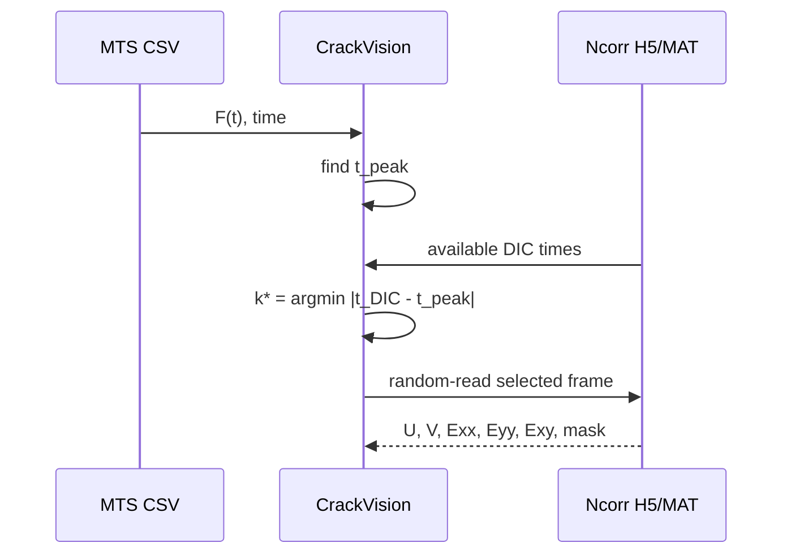
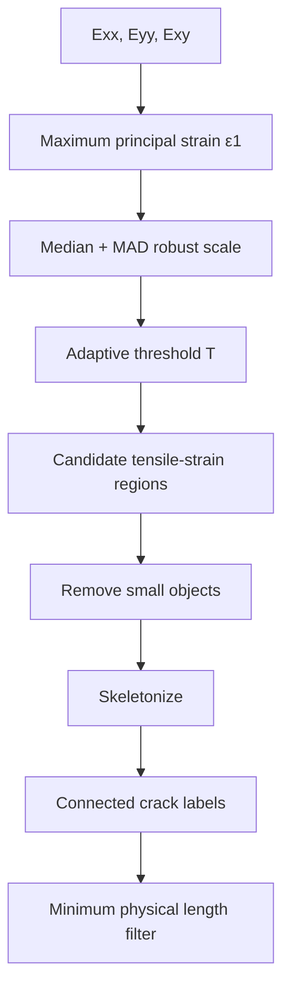
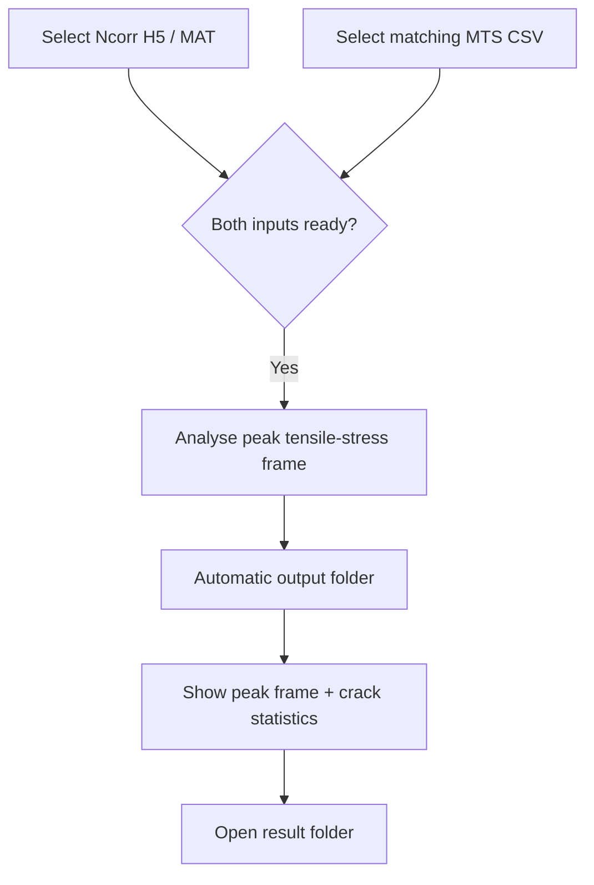
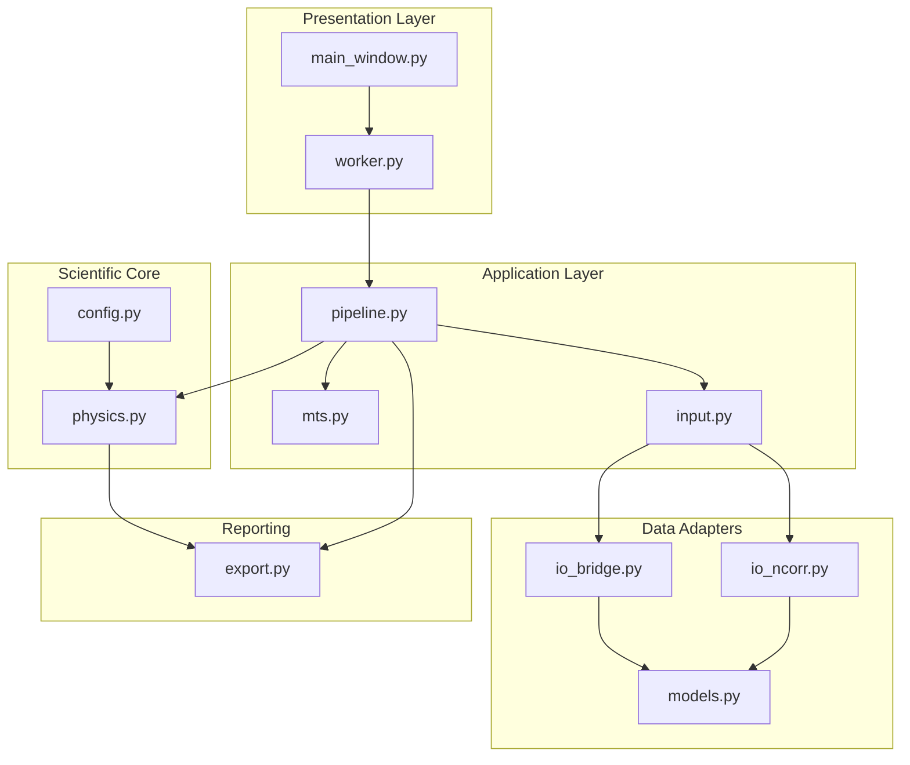

# CrackVision-DIC

<p align="center">
  <strong>Peak-stress-state crack opening displacement analysis for ECC / SHCC tensile tests</strong>
</p>

<p align="center">
  Ncorr displacement / strain fields × MTS tensile data → peak-stress frame → crack-wise COD → paper-ready statistics
</p>

<p align="center">
  
  
  
  
</p>

---

## Overview

**CrackVision-DIC** is a focused scientific post-processing tool for extracting crack opening displacement (**COD**) from **ECC / SHCC tensile-test DIC fields calculated by Ncorr**.

The project is intentionally narrow. It does not attempt to become a general-purpose DIC platform, image crack-segmentation system, MTS dashboard, or multi-mode reporting framework. Its only scientific objective is:

> **Locate the DIC frame corresponding to the peak tensile-stress state, identify all accepted cracks in that frame, calculate crack-wise COD from the Ncorr displacement field, and export publication-oriented crack-width statistics.**

For the present experimental workflow, MTS acquisition and image acquisition start simultaneously:

\[
t_{\mathrm{MTS},0}=t_{\mathrm{DIC},0}=0.
\]

Therefore no manual synchronization offset is required in the GUI.

---

## Scientific workflow


```mermaid
flowchart LR
    A[MTS raw CSV] --> B[Parse force and time]
    B --> C[Peak tensile-force time]

    D[Ncorr H5 / MAT] --> E[DIC time axis]
    C --> F[Nearest-frame matching]
    E --> F

    F --> G[Selected peak-stress DIC frame]
    G --> H[U, V, Exx, Eyy, Exy]

    H --> I[Maximum principal tensile strain]
    I --> J[Adaptive crack candidate field]
    J --> K[Skeletonization and crack labeling]
    K --> L[Local crack tangent / normal]

    H --> M[Displacement sampling on both crack faces]
    L --> M
    M --> N[Robust bilateral linear regression]
    N --> O[Extrapolation to crack plane]
    O --> P[Local COD]

    P --> Q[Median COD per crack]
    Q --> R[Equal-weight specimen statistics]
    R --> S[Paper-ready Excel]
```

The scientific chain can be summarized as

\[
\boxed{
\text{MTS peak state}
\rightarrow
\text{DIC frame}
\rightarrow
\varepsilon_1
\rightarrow
\text{crack geometry}
\rightarrow
\Delta \mathbf{u}\cdot\mathbf{n}
\rightarrow
\text{COD}
}
\]

---

# 1. Peak tensile-stress state selection

## 1.1 Why peak force is sufficient

For a tensile specimen whose nominal cross-sectional area \(A\) is fixed for stress calculation,

\[
\sigma(t)=\frac{F(t)}{A}.
\]

Hence

\[
\operatorname*{arg\,max}_t \sigma(t)
=
\operatorname*{arg\,max}_t F(t).
\]

Therefore **cross-sectional area is not required to locate the peak-stress DIC frame**. MTS is used only to determine the target time; it does not participate in the COD calculation itself.

Because some MTS exports use positive tension and others use negative tension, CrackVision first determines the tensile sign convention \(s\in\{-1,+1\}\), then identifies

\[
t_{\mathrm{peak}}
=
\operatorname*{arg\,max}_t \left[sF(t)\right].
\]

## 1.2 DIC frame matching

Let the available DIC frame times be

\[
\{t_0^{\mathrm{DIC}},t_1^{\mathrm{DIC}},\ldots,t_{N-1}^{\mathrm{DIC}}\}.
\]

The selected frame index is

\[
k^*
=
\operatorname*{arg\,min}_{k}
\left|t_k^{\mathrm{DIC}}-t_{\mathrm{peak}}\right|.
\]

The temporal matching error exported for QA is

\[
\Delta t
=
t_{k^*}^{\mathrm{DIC}}-t_{\mathrm{peak}}.
\]

For the current acquisition interval of 5 s/image, the absolute theoretical nearest-frame mismatch is normally bounded by approximately half one acquisition interval when both clocks start together.


```mermaid
sequenceDiagram
    participant MTS as MTS CSV
    participant CV as CrackVision
    participant DIC as Ncorr H5/MAT

    MTS->>CV: F(t), time
    CV->>CV: find t_peak
    DIC->>CV: available DIC times
    CV->>CV: k* = argmin |t_DIC - t_peak|
    CV->>DIC: random-read selected frame
    DIC-->>CV: U, V, Exx, Eyy, Exy, mask
```

---

# 2. Ncorr data contract

For new experiments, the recommended input is the compact CrackVision HDF5 bridge generated directly from a completed Ncorr analysis.

The bridge deliberately retains only the physical fields needed for crack-width analysis:

```text
/
├─ fields/
│  ├─ u
│  ├─ v
│  ├─ exx
│  ├─ eyy
│  ├─ exy
│  └─ mask
├─ time_s
└─ attributes
   ├─ coordinate_system = reference
   ├─ strain_measure = Green-Lagrange
   ├─ pixel_size_mm
   ├─ ncorr_spacing_raw
   ├─ dic_step_px
   ├─ dic_point_spacing_mm
   ├─ sampling_interval_s
   └─ numeric_precision
```

The exported displacement and strain fields are taken from the **reference configuration**:

```text
plot_u_ref_formatted
plot_v_ref_formatted
plot_exx_ref_formatted
plot_eyy_ref_formatted
plot_exy_ref_formatted
```

This prevents mixing displacement and strain fields defined in inconsistent configurations.

## 2.1 Ncorr grid spacing

Ncorr's native `spacing` is treated as a skipped-pixel count. Therefore the DIC subset-centre step is

\[
\Delta p_{\mathrm{DIC}}
=
\text{spacing}_{\mathrm{Ncorr}}+1.
\]

If the physical image scale is

\[
p=\text{pixel\_size\_mm}\quad [\mathrm{mm/pixel}],
\]

then one DIC-grid index step corresponds to

\[
\Delta x_{\mathrm{DIC}}
=
p\,\Delta p_{\mathrm{DIC}}
\quad [\mathrm{mm/point}].
\]

This distinction is important: **displacement scale and DIC-grid geometric spacing are related but not interchangeable quantities**.

---

# 3. Crack localization from maximum principal tensile strain

Crack candidates are detected from the maximum principal tensile strain rather than from a single Cartesian strain component. This makes the detector insensitive to whether a crack is horizontal, vertical, or inclined with respect to the image axes.

For the 2D Green-Lagrange strain tensor

\[
\mathbf{E}
=
\begin{bmatrix}
E_{xx} & E_{xy}\\
E_{xy} & E_{yy}
\end{bmatrix},
\]

the maximum principal tensile strain is

\[
\boxed{
\varepsilon_1
=
\frac{E_{xx}+E_{yy}}{2}
+
\sqrt{
\left(\frac{E_{xx}-E_{yy}}{2}\right)^2
+E_{xy}^2
}
}
\]

where the current Ncorr bridge treats \(E_{xy}\) as the **tensor Green-Lagrange shear component**, not engineering shear.

---

# 4. Robust adaptive crack threshold

A fixed strain threshold is not used as the sole crack criterion. Instead, each selected frame obtains its own robust background-dependent threshold.

Let the valid maximum-principal-strain values be \(\{\varepsilon_{1,i}\}\). Define

\[
m
=
\operatorname{median}(\varepsilon_1),
\]

\[
\operatorname{MAD}
=
\operatorname{median}
\left(
|\varepsilon_1-m|
\right),
\]

and the robust scale estimator

\[
\hat{\sigma}_{r}
=
1.4826\,\operatorname{MAD}.
\]

The raw threshold is

\[
T_{\mathrm{raw}}
=
m+k\hat{\sigma}_{r},
\]

with the current default

\[
k=2.0.
\]

The actual threshold is clipped to a physically bounded interval:

\[
\boxed{
T
=
\operatorname{clip}
\left(
T_{\mathrm{raw}},
2\times10^{-4},
5\times10^{-2}
\right)
}
\]

and candidate pixels satisfy

\[
\varepsilon_1\ge T,
\qquad
\varepsilon_1>0.
\]

Small connected candidate objects are removed, followed by skeletonization. The current defaults require at least 4 candidate DIC points and a minimum accepted skeleton length of 0.15 mm.


```mermaid
flowchart TD
    A[Exx, Eyy, Exy] --> B[Maximum principal strain ε1]
    B --> C[Median + MAD robust scale]
    C --> D[Adaptive threshold T]
    D --> E[Candidate tensile-strain regions]
    E --> F[Remove small objects]
    F --> G[Skeletonize]
    G --> H[Connected crack labels]
    H --> I[Minimum physical length filter]
```

---

# 5. Local crack coordinate system

For each skeleton point, CrackVision estimates the local crack tangent from neighbouring skeleton coordinates using a local covariance / eigenvector analysis.

Let the normalized tangent be

\[
\mathbf{t}
=
\begin{bmatrix}
t_x\\t_y
\end{bmatrix},
\qquad
\|\mathbf{t}\|=1.
\]

The corresponding unit normal is

\[
\mathbf{n}
=
\begin{bmatrix}
-n_y^{(t)}\\n_x^{(t)}
\end{bmatrix}
=
\begin{bmatrix}
-t_y\\t_x
\end{bmatrix}.
\]

In implementation notation,

\[
\mathbf{n}=(n_x,n_y),
\qquad
\mathbf{t}=(-n_y,n_x).
\]

This local coordinate frame allows COD to be measured **normal to the actual local crack orientation**, rather than along the global \(x\)- or \(y\)-axis.

---

# 6. COD from bilateral displacement regression

The crack width is **not** obtained from the apparent thickness of the strain band. The strain field is used to localize the crack; the width itself is calculated from the displacement discontinuity.

For a DIC displacement vector

\[
\mathbf{u}
=
\begin{bmatrix}
u\\v
\end{bmatrix},
\]

the local normal and tangential displacement components are

\[
u_n
=
\mathbf{u}\cdot\mathbf{n}
=
un_x+vn_y,
\]

\[
u_t
=
\mathbf{u}\cdot\mathbf{t}
=
-un_y+vn_x.
\]

## 6.1 Bilateral sampling

At each skeleton point, displacement samples are taken on both sides of the crack over the physical interval

\[
0.15\ \mathrm{mm}
\le |s| \le
0.75\ \mathrm{mm}.
\]

The current default uses 7 requested sample locations per side and requires at least 3 valid samples on each side.

## 6.2 Crack-face regression

For the positive and negative crack faces, the normal displacement is independently approximated as

\[
u_n^{+}(s)=a_{+}s+b_{+},
\]

\[
u_n^{-}(s)=a_{-}s+b_{-}.
\]

The fits are iteratively filtered using residual median absolute deviation. If \(r_i\) denotes a residual,

\[
\tilde r
=
\operatorname{median}(r_i),
\]

\[
\hat\sigma_r
=
1.4826\operatorname{median}\left(|r_i-\tilde r|\right),
\]

and the default robust retention rule is

\[
|r_i-\tilde r|
\le
3.5\hat\sigma_r.
\]

This suppresses isolated interpolation or DIC outliers without converting the fit into a single-point displacement jump.

## 6.3 Crack-plane extrapolation

The fitted crack-face displacements are evaluated at the crack plane \(s=0\):

\[
u_n^{+}(0)=b_{+},
\qquad
u_n^{-}(0)=b_{-}.
\]

The local crack opening displacement is therefore

\[
\boxed{
\mathrm{COD}
=
\left|b_{+}-b_{-}\right|
}
\]

in displacement-field units, followed by conversion to physical length according to the `FrameData` displacement-scale contract.

The same construction is applied to \(u_t\) to obtain a tangential-slip diagnostic, while the reported crack width is the normal opening component.


```mermaid
flowchart LR
    A[Crack skeleton point] --> B[Estimate local normal n]
    B --> C[Sample +n face]
    B --> D[Sample -n face]
    C --> E[Project U,V onto n]
    D --> F[Project U,V onto n]
    E --> G[Robust line fit +]
    F --> H[Robust line fit -]
    G --> I[Extrapolate to s = 0]
    H --> I
    I --> J[COD = abs b+ - b-]
```

---

# 7. From local COD to one width per crack

One geometric crack generally contains multiple valid local COD measurements:

\[
\{w_{j,1},w_{j,2},\ldots,w_{j,m_j}\},
\]

where \(j\) denotes the crack ID.

A crack is retained only if it contains at least the configured minimum number of valid COD samples. The current default is

\[
m_j\ge3.
\]

Its representative crack width is defined as

\[
\boxed{
w_j
=
\operatorname{median}_{i}
\left(w_{j,i}\right)
}
\]

rather than by one arbitrarily selected measurement point.

The default representative-width acceptance range is

\[
1\ \mu\mathrm{m}
\le w_j \le
2\ \mathrm{mm}.
\]

`02_裂缝明细` exports this value as **代表宽度 (μm)**.

---

# 8. Equal-weight specimen statistics

Suppose the selected peak-stress frame contains \(N_c\) accepted cracks with representative widths

\[
\{w_1,w_2,\ldots,w_{N_c}\}.
\]

Each physical crack contributes exactly one value to the specimen-level statistics, irrespective of crack length or number of local COD samples.

The paper-facing average crack width is

\[
\boxed{
\bar w
=
\frac{1}{N_c}
\sum_{j=1}^{N_c}w_j
}
\]

with companion statistics

\[
w_{50}
=
\operatorname{median}(w_j),
\]

\[
w_{95}
=
Q_{0.95}(w_j),
\]

\[
w_{\max}
=
\max_j w_j.
\]

This prevents a long crack from receiving greater statistical weight merely because more local COD sampling points lie on its skeleton.

The primary specimen-level fields are therefore conceptually

```text
Crack_width_mean
Crack_width_median
Crack_width_95
Crack_width_max
```

with the final Excel report presented in μm.

---

# 9. Default scientific parameters

| Category | Parameter | Default | Role |
|---|---:|---:|---|
| Crack detection | `threshold_k` | 2.0 | Robust principal-strain threshold multiplier |
| Crack detection | `min_tensile_strain` | 0.0002 | Lower threshold bound |
| Crack detection | `max_threshold` | 0.05 | Upper threshold bound |
| Morphology | `min_crack_area_points` | 4 | Remove isolated candidate noise |
| Geometry | `min_crack_length_mm` | 0.15 mm | Minimum accepted crack skeleton length |
| Local orientation | `normal_radius_points` | 4 | Neighbourhood for tangent / normal estimation |
| COD sampling | `near_mm` | 0.15 mm | Nearest displacement sample distance |
| COD sampling | `far_mm` | 0.75 mm | Farthest displacement sample distance |
| COD sampling | `samples_per_side` | 7 | Requested samples per crack face |
| COD sampling | `min_valid_per_side` | 3 | Minimum valid samples per face |
| Crack acceptance | `min_samples_per_crack` | 3 | Minimum valid local COD values per crack |
| Width filter | `min_width_mm` | 0.001 mm | Minimum accepted representative width |
| Width filter | `max_width_mm` | 2.0 mm | Maximum accepted local width |
| Robust fit | `robust_sigma` | 3.5 | Residual MAD outlier cutoff |

These values are centralized in `config/default.yaml` so the scientific assumptions remain inspectable and reproducible.

---

# 10. Recommended Ncorr → CrackVision bridge

For new tests, do not make CrackVision repeatedly parse a very large Ncorr save file. After the standard Ncorr calculation is complete, export only the fields required by the COD pipeline.

```matlab
handles_ncorr = ncorr;

% ... normal Ncorr workflow ...
% DIC Analysis
% Format Displacements
% Get Unit Conversion (mm)
% Calculate Strains

addpath('path/to/CrackVision-DIC/matlab')

export_ncorr_to_crackvision( ...
    handles_ncorr, ...
    'Specimen01_CrackVision.h5', ...
    5);   % sampling interval: 5 s/image
```

Existing saved Ncorr MAT files can also be converted:

```matlab
export_ncorr_to_crackvision( ...
    'Specimen01.mat', ...
    'Specimen01_CrackVision.h5', ...
    5);
```

The compact H5 format allows CrackVision to read the time vector first and then **random-read only the selected peak-stress frame**.

---

# 11. Minimal GUI / UX

The desktop workflow contains only two inputs and one scientific action:


```mermaid
flowchart TD
    A[Select Ncorr H5 / MAT] --> C{Both inputs ready?}
    B[Select matching MTS CSV] --> C
    C -->|Yes| D[Analyse peak tensile-stress frame]
    D --> E[Automatic output folder]
    E --> F[Show peak frame + crack statistics]
    F --> G[Open result folder]
```

The application intentionally does **not** expose experimental assumptions that are already fixed for this workflow, such as synchronization offset or output-folder selection.

Results are written automatically to

```text
<Ncorr folder>/
└─ CrackVision_Output/
   └─ <specimen>_CrackVision.xlsx
```

---

# 12. Excel output

Each specimen produces one compact workbook with three research-facing sheets.

```text
<specimen>_CrackVision.xlsx
├─ 01_结果汇总
├─ 02_裂缝明细
└─ 03_质量检查
```

## `01_结果汇总`

Publication-oriented specimen summary:

- peak tensile force
- peak time
- selected DIC frame
- frame matching error
- accepted crack count
- mean crack width
- median crack width
- P95 crack width
- maximum crack width
- COD status
- per-crack width chart

## `02_裂缝明细`

One row per accepted physical crack:

| Column | Meaning |
|---|---|
| 裂缝编号 | Connected crack ID in the selected skeleton |
| 裂缝长度 (mm) | Skeleton-based physical crack length |
| 代表宽度 (μm) | Median valid local COD of this crack |
| COD 有效点数 | Number of valid local COD measurements |
| 拟合 R² 中位数 | Median bilateral normal-fit quality indicator |

For crack-width distributions, **代表宽度 (μm)** is the primary per-crack quantity.

## `03_质量检查`

Compact audit information including:

- COD status
- MTS peak force / time
- selected DIC frame / time
- temporal matching error
- pixel scale
- DIC grid step and physical point spacing
- valid DIC fraction
- principal-strain threshold
- candidate and skeleton point counts
- metadata source

Failed measurements remain `NaN`; they are never silently converted to a physically false `0 μm`.

---

# 13. Software architecture


```mermaid
flowchart TB
    subgraph GUI[Presentation Layer]
        MW[main_window.py]
        WK[worker.py]
    end

    subgraph PIPE[Application Layer]
        PL[pipeline.py]
        MTS[mts.py]
        IN[input.py]
    end

    subgraph IO[Data Adapters]
        H5[io_bridge.py]
        MAT[io_ncorr.py]
        MD[models.py]
    end

    subgraph CORE[Scientific Core]
        PH[physics.py]
        CF[config.py]
    end

    subgraph OUT[Reporting]
        EX[export.py]
    end

    MW --> WK --> PL
    PL --> MTS
    PL --> IN
    IN --> H5
    IN --> MAT
    H5 --> MD
    MAT --> MD
    PL --> PH
    CF --> PH
    PH --> EX
    PL --> EX
```

The architecture follows one principle: **I/O, scientific physics, orchestration, GUI, and reporting must remain separable**.

---

# 14. Repository structure

```text
CrackVision-DIC/
├─ main.py
├─ config/
│  └─ default.yaml
├─ matlab/
│  └─ export_ncorr_to_crackvision.m
├─ src/
│  ├─ core/
│  │  ├─ config.py
│  │  ├─ mts.py
│  │  ├─ input.py
│  │  ├─ io_bridge.py
│  │  ├─ io_ncorr.py
│  │  ├─ models.py
│  │  ├─ physics.py
│  │  ├─ pipeline.py
│  │  └─ export.py
│  └─ gui/
│     ├─ main_window.py
│     └─ worker.py
└─ tests/
```

---

# 15. Installation and run

Python 3.10+ is recommended.

```bash
python -m venv .venv
```

Windows:

```bash
.venv\Scripts\activate
pip install -r requirements.txt
python main.py
```

---

# 16. Validation

Install development dependencies and run the regression suite:

```bash
pip install -r requirements-dev.txt
python -m pytest -q
```

The current test suite covers, among other items:

- maximum-principal-strain calculation
- horizontal / vertical crack orientation invariance
- background displacement-gradient removal by bilateral regression
- Ncorr spacing semantics
- classic MAT and MATLAB v7.3/HDF5 loading
- compact CrackVision-Ncorr H5 loading
- MTS peak-time parsing for positive and negative tension signs
- peak-frame selection
- equal-weight per-crack specimen statistics
- Excel workbook layout and reporting structure

---

# 17. Scope and design philosophy

CrackVision-DIC deliberately excludes features that do not strengthen the central scientific measurement chain.

**Included**

- Ncorr reference-configuration displacement and strain fields
- MTS peak-stress-state selection
- principal-strain crack localization
- local crack-normal estimation
- regression-based COD
- crack-wise representative width
- equal-weight specimen statistics
- compact QA and Excel reporting

**Intentionally excluded**

- camera-image crack segmentation as the primary width method
- image-thickness-based crack width estimation
- MTS curve dashboards
- batch analytics dashboards
- machine-learning crack detection
- multiprocessing / temporary-file orchestration
- multiple competing report systems
- unrelated material-property modules

The intended use is not “more features”; it is **a smaller and more defensible measurement pipeline**.

---

## Method in one equation chain

For a selected peak-stress frame,

\[
\boxed{
\begin{aligned}
t_{\mathrm{peak}}
&=\operatorname*{arg\,max}_t[sF(t)] \\
\\
k^*
&=\operatorname*{arg\,min}_k|t_k^{\mathrm{DIC}}-t_{\mathrm{peak}}| \\
\\
\varepsilon_1
&=\frac{E_{xx}+E_{yy}}{2}
+\sqrt{\left(\frac{E_{xx}-E_{yy}}{2}\right)^2+E_{xy}^2} \\
\\
\mathrm{COD}_{j,i}
&=\left|b_{j,i}^{+}-b_{j,i}^{-}\right| \\
\\
w_j
&=\operatorname{median}_i(\mathrm{COD}_{j,i}) \\
\\
\bar w
&=\frac{1}{N_c}\sum_{j=1}^{N_c}w_j
\end{aligned}
}
\]

where \(s\) is the inferred tensile sign, \(k^*\) is the nearest DIC frame, \(b^{+}\) and \(b^{-}\) are the bilateral crack-face regression intercepts extrapolated to the crack plane, \(w_j\) is the representative width of crack \(j\), and \(\bar w\) is the equal-weight specimen average crack width.

---

<p align="center">
  <strong>CrackVision-DIC</strong><br/>
  From Ncorr fields to reproducible ECC crack-width statistics.
</p>
