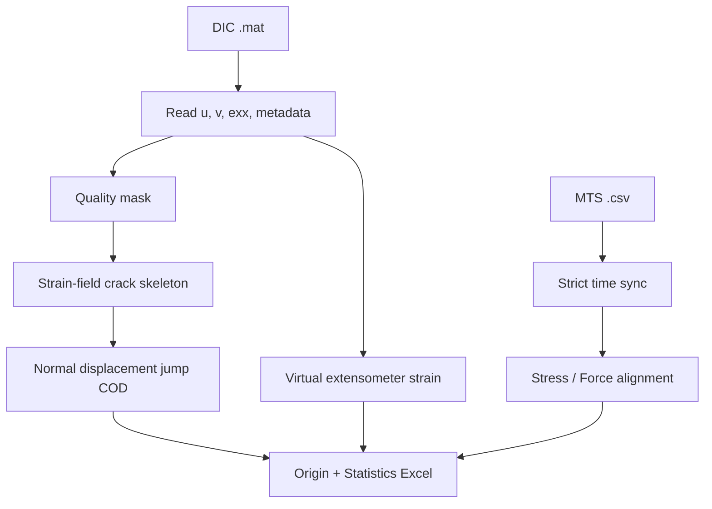

# CrackVision-DIC

[](https://www.python.org/downloads/)
[](https://wiki.qt.io/Qt_for_Python)
[](#)

CrackVision-DIC 是我维护的一个面向 ECC / UHPC 拉伸试验的 DIC 裂缝演化后处理工具。它不替代 Ncorr、DICe、VIC-2D 等原始 DIC 求解器，而是读取 DIC 导出的 `.mat` 位移/应变场，并结合 MTS 力学时序数据，输出裂缝数量、裂缝间距、裂缝宽度分布、应变梯度切片和 QA 验证表。

I built this project for one practical purpose: make DIC crack analysis easier to audit, repeat, and plot for cementitious composites research.

## Current Scope

CrackVision-DIC 当前适合做：

- Ncorr `.mat` displacement / strain field post-processing
- ECC / UHPC direct tension crack evolution analysis
- crack count, crack spacing, average COD, max COD, 99% COD extraction
- MTS force-displacement-time synchronization
- Origin-friendly Excel export
- QA metadata and manual annotation validation

它不是一个从原始散斑图片开始做相关匹配的 DIC 求解器。原始图像相关计算仍建议在 Ncorr、DICe、VIC-2D 或同类软件中完成。

## Why This Version Matters

我对核心计算链路做了一次比较大的重构，重点修正了之前最容易影响论文数据可信度的部分：

| Area | Previous Risk | Current Handling |
| --- | --- | --- |
| Scale system | `mm_per_pixel` and DIC grid spacing could be mixed | `pixel_size_mm` and `dic_point_spacing_mm` are separated |
| Crack length | DIC grid point count could be treated as raw pixel count | length uses `pixel_size_mm * subset_spacing_px` |
| COD | horizontal `u` projection could underestimate angled cracks | default COD uses normal projection of `u + v` displacement jump |
| Global strain | edge-column displacement could be tied to wrong gauge length | virtual extensometer is used first |
| MTS sync | time mismatch could be extrapolated silently | strict overlap check, no silent extrapolation |
| QA | no clear validation status | `05_QA_Metadata` and `06_Validation` are exported |

## Processing Pipeline


```mermaid
flowchart TD
    A["DIC .mat"] --> B["Read u, v, exx, metadata"]
    C["MTS .csv"] --> D["Strict time sync"]
    B --> E["Quality mask"]
    E --> F["Strain-field crack skeleton"]
    F --> G["Normal displacement jump COD"]
    B --> H["Virtual extensometer strain"]
    D --> I["Stress / Force alignment"]
    G --> J["Origin + Statistics Excel"]
    H --> J
    I --> J
```

## Core Calculation

### 1. Scale and DIC Grid Spacing

Ncorr 的位移值通常以 image pixel displacement 表示，但导出的位移/应变矩阵不是原始相机每个像素一个点，而是 subset centers 构成的 DIC grid。

因此我在代码里分开处理：

```text
pixel_size_mm          = raw image pixel scale, mm/px
subset_spacing_px      = DIC subset/grid spacing, px
dic_point_spacing_mm   = pixel_size_mm * subset_spacing_px
```

COD 的位移值使用 `pixel_size_mm` 转换；裂缝长度、搜索半径、虚拟引伸计长度使用 `dic_point_spacing_mm`。

### 2. Crack Opening Displacement

默认使用二维位移场的法向位移跳跃：

```text
w = abs((u_plus - u_minus) * nx + (v_plus - v_minus) * ny) * pixel_size_mm
```

如果 `.mat` 中没有 `v` 位移场，严格模式下会拒绝 COD 计算，避免斜裂缝被水平位移低估。确实需要兼容旧数据时，可以在 `config/default.yaml` 中改：

```yaml
physics:
  require_v_map_for_cod: false
```

### 3. Global Strain

全局应变默认由 virtual extensometer 计算。软件会在有效 DIC 区域内取左右两条竖向采样带，使用两带的中位位移差计算应变。

```yaml
experiment:
  virtual_extensometer:
    left_fraction: 0.10
    right_fraction: 0.90
    band_width_points: 3
    gauge_length_mm:
```

如果 `gauge_length_mm` 留空，软件会根据 DIC grid spacing 自动估算虚拟标距。若你希望严格使用试验标距，可以手动填写该值。

## Output Files

每个试件会导出两个 Excel 文件：

### `[Specimen]_Origin_Plot_Data.xlsx`

| Sheet | Usage |
| --- | --- |
| `Fig1_Dynamics` | strain-crack count-width evolution |
| `Fig2_Normalized` | normalized strain comparison |
| `Fig3_Distribution` | saturated / ultimate crack width distribution |
| `Fig4_Gradient` | strain-gradient crack width slices |

### `[Specimen]_Statistics_Report.xlsx`

| Sheet | Usage |
| --- | --- |
| `01_Macro_Summary` | UTS, ultimate strain, saturated crack count, width summary |
| `02_Gradient_States` | selected strain-level statistics |
| `03_Saturated_Cracks` | crack-level details at saturated state |
| `04_Ultimate_Cracks` | crack-level details at ultimate state |
| `05_QA_Metadata` | scale, spacing, quality, sync and COD status |
| `06_Validation` | manual annotation comparison if annotation exists |

## Manual Annotation Validation

为了避免 DIC 后处理结果变成“黑箱数据”，我加入了人工标注验证入口。

把以下任意文件放在 `.mat` 同目录：

```text
<specimen>_annotations.csv
<specimen>_annotation.csv
<specimen>_annotations.xlsx
```

最小字段：

```csv
Frame
```

推荐字段：

```csv
Frame,crack_count,W_avg_um,W_max_um
0,0,0,0
10,5,28.4,65.2
20,8,42.1,101.7
```

如果检测到标注文件，`06_Validation` 会输出 MAE、Bias 和 MaxAbsError；如果没有标注文件，表格会明确写出未找到标注，而不是默认假设结果已经验证。

## Installation

```bash
git clone https://github.com/liqinglq666/CrackVision-DIC.git
cd CrackVision-DIC

conda create -n crackvision_env python=3.10 -y
conda activate crackvision_env

pip install -r requirements.txt
python main.py
```

## Configuration

主要参数在 `config/default.yaml`：

```yaml
experiment:
  mm_per_pixel: 0.045
  dic_subset_spacing_px: 1.0
  sampling_interval_s: 5.0
  cross_section_area_mm2: 100.0
  gauge_length_mm: 80.0

sync:
  min_overlap_fraction: 0.60
  max_missing_fraction: 0.05
  override_dic_strain_with_mts: false

quality:
  enabled: true
  metric_mode: finite_only
  threshold:
  min_valid_fraction: 0.20

physics:
  require_v_map_for_cod: true
  max_cracking_strain_threshold: 0.03
  cod_min_mm: 0.002
  cod_min_mean_mm: 0.002
  cod_max_mm: 5.0
```

## Data Reliability Notes

我建议正式用于论文前至少做三步检查：

1. 检查 `05_QA_Metadata` 中的 `pixel_size_mm`、`subset_spacing_px`、`dic_point_spacing_mm` 是否符合你的 Ncorr 设置。
2. 用几帧人工标注裂缝数量和裂缝宽度，检查 `06_Validation`。
3. 对比 MTS 应变和 DIC virtual extensometer strain，确认同步关系和标距设置没有问题。

## Verification Status

当前版本已经通过 Python syntax compilation。完整运行仍依赖真实 Ncorr `.mat` 文件、MTS `.csv` 文件以及本地依赖环境。

## License

本仓库目前没有单独发布开源许可证。使用、复用或二次发布前，请先联系维护者确认授权方式。
