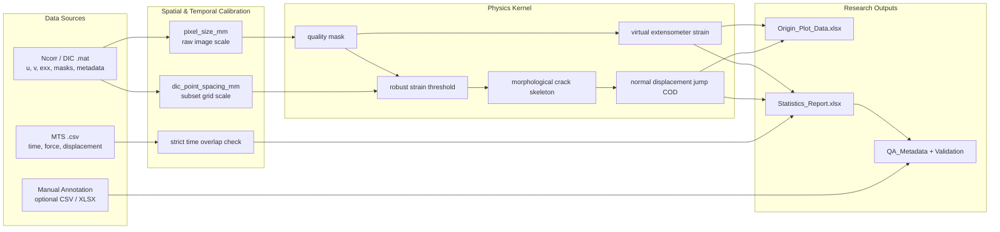
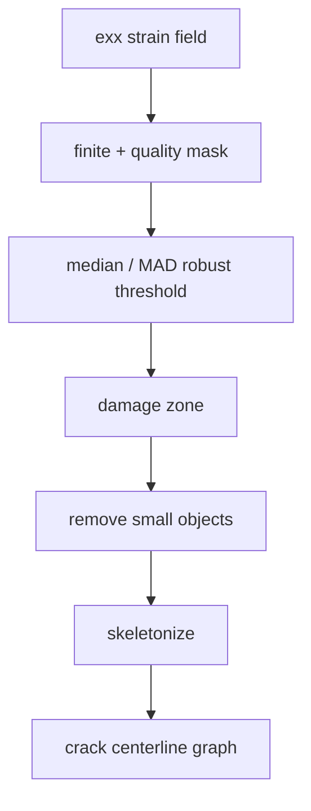
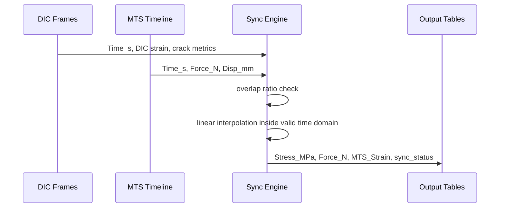
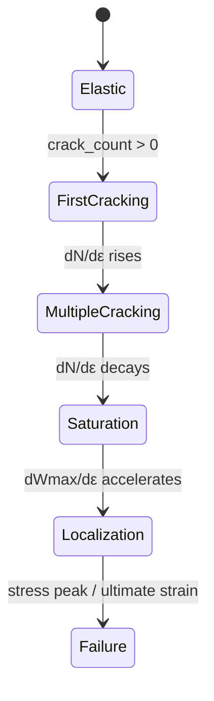

# CrackVision-DIC

[](https://www.python.org/downloads/)
[](https://wiki.qt.io/Qt_for_Python)
[](#)
[](#)

CrackVision-DIC 是一个面向 ECC / UHPC / cementitious composites 拉伸试验的 DIC 裂缝演化后处理系统。它不替代 Ncorr、DICe、VIC-2D 等原始 DIC solver，而是读取 DIC 导出的 `.mat` 位移场、应变场与空间标定信息，并与 MTS 力学时序数据进行同步，输出 crack count、crack spacing、COD、分位宽度、应变梯度切片以及 QA metadata。

项目的核心目标不是“多生成几张图”，而是建立一条可审计、可复现、可解释的 micro-cracking kinetics pipeline：从 DIC grid 到裂缝骨架，从法向位移跳量到裂缝宽度，从宏观载荷时序到微观裂缝统计，最后形成可以直接进入 Origin、论文表格和数据复核流程的结构化结果。

## System Overview


```mermaid
flowchart LR
    subgraph Input["Data Sources"]
        A["Ncorr / DIC .mat<br/>u, v, exx, masks, metadata"]
        B["MTS .csv<br/>time, force, displacement"]
        C["Manual Annotation<br/>optional CSV / XLSX"]
    end

    subgraph Calibration["Spatial & Temporal Calibration"]
        D["pixel_size_mm<br/>raw image scale"]
        E["dic_point_spacing_mm<br/>subset grid scale"]
        F["strict time overlap check"]
    end

    subgraph Physics["Physics Kernel"]
        G["quality mask"]
        H["robust strain threshold"]
        I["morphological crack skeleton"]
        J["normal displacement jump COD"]
        K["virtual extensometer strain"]
    end

    subgraph Export["Research Outputs"]
        L["Origin_Plot_Data.xlsx"]
        M["Statistics_Report.xlsx"]
        N["QA_Metadata + Validation"]
    end

    A --> D --> G
    A --> E --> H
    B --> F
    C --> N
    G --> H --> I --> J
    G --> K
    F --> M
    J --> L
    K --> L
    J --> M
    K --> M
    M --> N
```

## 适用范围

CrackVision-DIC 适合处理以下任务：

- ECC / UHPC 单轴拉伸或直接拉伸试验的 DIC 后处理；
- Ncorr `.mat` displacement / strain field 数据批量分析；
- 裂缝数量、裂缝间距、平均 COD、最大 COD、P99 COD 的时序提取；
- DIC virtual extensometer strain 与 MTS stress / displacement 的时域同步；
- 面向 OriginLab、Excel、Python plotting 的宽表导出；
- 人工标注对照、质量掩码、尺度信息和同步状态的 QA 追踪。

它不负责从原始 speckle images 中求解位移场。原始图像相关匹配仍建议在 Ncorr、DICe、VIC-2D 或同类 DIC solver 中完成。

## 计算逻辑

### 1. 双尺度空间标定：pixel scale 与 DIC grid scale 分离

DIC 位移值通常以 raw image pixel displacement 表示，但 DIC 输出矩阵的采样点并不是相机原始像素，而是 subset centers 组成的离散网格。因此本项目将两个尺度严格分离：

```text
pixel_size_mm        = raw image pixel scale, mm / px
subset_spacing_px    = DIC subset center spacing, px / point
dic_point_spacing_mm = pixel_size_mm * subset_spacing_px
```

其中：

- 位移跳量 `u, v` 的量纲转换使用 `pixel_size_mm`；
- 裂缝长度、骨架点间距、搜索半径、virtual extensometer 的几何距离使用 `dic_point_spacing_mm`；
- 这样可以避免把 DIC grid point 错当成 raw pixel，从而系统性低估或高估 crack length。

### 2. 有效域与质量掩码：Quality-aware finite field

每一帧先建立有效计算域：

$$
\Omega_q = \Omega_{mask} \cap finite(u) \cap finite(v) \cap Q
$$

其中 `Q` 可以来自 DIC quality map。若没有质量图，系统采用 `finite_only` 策略，只保留位移场和应变场数值有效的区域。有效比例定义为：

$$
r_q = \frac{|\Omega_q|}{|\Omega_{mask}|}
$$

当 `r_q` 低于 `quality.min_valid_fraction` 时，该帧会被标记为 `quality_rejected`，避免失相关区域污染 crack statistics。

### 3. 鲁棒开裂阈值：MAD-based strain segmentation

裂缝候选区域由 `exx` 场的稳健统计阈值提取。系统不直接使用均值和标准差，因为裂缝尖端和局部失相关容易产生 heavy-tail noise。默认使用 median absolute deviation：

$$
\tilde{\varepsilon} = median(\varepsilon_{xx})
$$

$$
MAD = median(|\varepsilon_{xx} - \tilde{\varepsilon}|)
$$

$$
\varepsilon_{th}
= clip\left(
\tilde{\varepsilon} + k \cdot 1.4826 \cdot MAD,\;
\varepsilon_{min},\;
\varepsilon_{max}
\right)
$$

候选裂缝域为：

$$
\Omega_c = \{(x,y)\in\Omega_q \mid \varepsilon_{xx}(x,y) > \varepsilon_{th}\}
$$

随后执行 small-object filtering 与 skeletonization，将二维高应变带压缩为一像素宽的 crack skeleton。


```mermaid
flowchart TD
    A["exx strain field"] --> B["finite + quality mask"]
    B --> C["median / MAD robust threshold"]
    C --> D["damage zone"]
    D --> E["remove small objects"]
    E --> F["skeletonize"]
    F --> G["crack centerline graph"]
```

### 4. 局部法向估计：PCA-like normal regression

对骨架点 $(x_c,y_c)$，系统在局部 $3\times3$ 邻域内估计 crack tangent，再取正交方向作为 sampling normal。局部协方差量为：

$$
S_{xx}=\sum (x_i-\bar{x})^2,\quad
S_{yy}=\sum (y_i-\bar{y})^2,\quad
S_{xy}=\sum (x_i-\bar{x})(y_i-\bar{y})
$$

骨架主方向角：

$$
\theta=\frac{1}{2}\arctan2(2S_{xy}, S_{xx}-S_{yy})
$$

法向向量：

$$
\mathbf n=(-\sin\theta,\cos\theta)
$$

这一步的意义是让 COD sampling line 与裂缝走向保持正交，而不是固定沿水平或竖直方向采样。

### 5. COD：Normal displacement jump

裂缝宽度采用跨裂缝两侧的法向位移跳量：

$$
w = \left| \Delta\mathbf u \cdot \mathbf n \right| \cdot s_p
$$

其中：

$$
\Delta\mathbf u =
\begin{bmatrix}
u^+ - u^- \\
v^+ - v^-
\end{bmatrix},
\quad
\mathbf n=
\begin{bmatrix}
n_x \\
n_y
\end{bmatrix},
\quad
s_p = pixel\_size\_mm
$$

展开为代码中的计算式：

```text
w_mm = abs((u_plus - u_minus) * nx + (v_plus - v_minus) * ny) * pixel_size_mm
```

当配置项 `physics.require_v_map_for_cod: true` 时，缺少 `v` 位移场会拒绝 COD 计算，以避免斜裂缝被单一水平位移投影低估。若需要兼容早期只有 `u` 的数据，可显式关闭该开关。

```yaml
physics:
  require_v_map_for_cod: true
  cod_sampling:
    delta_points: 3
    max_search_points: 15
```

### 6. 裂缝对象过滤与统计

骨架连通域被标记为独立 crack objects。每条裂缝的长度、平均宽度、最大宽度由其骨架采样点统计：

$$
L_i = N_i \cdot dic\_point\_spacing\_mm
$$

$$
\bar{w}_i=\frac{1}{N_i}\sum_{j=1}^{N_i} w_{ij},\quad
w_i^{max}=\max_j(w_{ij})
$$

对象级过滤条件：

$$
L_i \ge L_{min},\quad
w_i^{max} \ge w_{min},\quad
\bar{w}_i \ge \bar{w}_{min}
$$

帧级统计：

$$
N_c = count(crack_i)
$$

$$
W_{avg}=mean(\bar{w}_i),\quad
W_{max}=\max(w_i^{max}),\quad
W_{99}=P_{99}(\{w_{ij}\})
$$

### 7. Virtual extensometer：DIC 全局应变

系统默认从 DIC 位移场中构造 virtual extensometer。它在有效区域左右两侧取竖向采样带，使用中位数位移差估计全局拉伸应变：

$$
\varepsilon_{DIC}
=
\frac{
|median(u_R)-median(u_L)| \cdot pixel\_size\_mm
}{
L_0
}
$$

若配置了 `virtual_extensometer.gauge_length_mm`，则使用该标距；否则由左右采样带在 DIC grid 中的距离自动估算：

$$
L_0 = |x_R-x_L| \cdot dic\_point\_spacing\_mm
$$

```yaml
experiment:
  virtual_extensometer:
    left_fraction: 0.10
    right_fraction: 0.90
    band_width_points: 3
    gauge_length_mm:
```

### 8. MTS 同步与应力换算

MTS 数据通过时间轴插值映射到 DIC 帧。同步不是无条件 extrapolation，而是先检查时间范围重叠：

$$
\rho_t =
\frac{
\min(t_{DIC}^{max}, t_{MTS}^{max})-\max(t_{DIC}^{min}, t_{MTS}^{min})
}{
t_{DIC}^{max}-t_{DIC}^{min}
}
$$

仅当：

$$
\rho_t \ge \rho_{min}
$$

才执行同步。应力换算为：

$$
\sigma(t)=\frac{|F(t)|}{A}
$$

若 MTS force 列以 kN 表示，系统会转为 N 后再除以截面积 `cross_section_area_mm2`，得到 MPa。


```mermaid
sequenceDiagram
    participant D as DIC Frames
    participant M as MTS Timeline
    participant S as Sync Engine
    participant O as Output Tables

    D->>S: Time_s, DIC strain, crack metrics
    M->>S: Time_s, Force_N, Disp_mm
    S->>S: overlap ratio check
    S->>S: linear interpolation inside valid time domain
    S->>O: Stress_MPa, Force_N, MTS_Strain, sync_status
```

## 状态机：从弹性阶段到局部化破坏

裂缝演化数据天然具有阶段性。CrackVision-DIC 的输出可支持以下 mechanics interpretation：


```mermaid
stateDiagram-v2
    [*] --> Elastic
    Elastic --> FirstCracking: crack_count > 0
    FirstCracking --> MultipleCracking: dN/dε rises
    MultipleCracking --> Saturation: dN/dε decays
    Saturation --> Localization: dWmax/dε accelerates
    Localization --> Failure: stress peak / ultimate strain
```

典型研究指标包括：

- first cracking strain：首次检测到有效裂缝的应变；
- saturated crack count：裂缝数量达到平台期附近的数量；
- saturated spacing：饱和裂缝间距；
- ultimate COD distribution：极限状态下裂缝宽度分布；
- localization signature：最大裂缝宽度增长率突增。

## 数据流伪代码

```python
for frame in dic_frames:
    quality_mask = build_quality_mask(frame.mask, frame.u, frame.v, frame.quality)
    strain_dic = virtual_extensometer(frame.u, quality_mask)
    skeleton = skeletonize(exx > robust_mad_threshold(exx, quality_mask))
    cod = normal_displacement_jump(frame.u, frame.v, skeleton)
    metrics.append({
        "strain": strain_dic,
        "crack_count": cod.count,
        "w_avg": cod.mean,
        "w_max": cod.max,
        "w_99": cod.p99,
    })

metrics = synchronize_with_mts(metrics, mts_csv)
export_origin_tables(metrics)
export_statistics_report(metrics)
```

## 输出文件

每个 specimen 会生成两个主要 Excel 文件。

### `[Specimen]_Origin_Plot_Data.xlsx`

| Sheet | 内容 | 用途 |
| --- | --- | --- |
| `Fig1_Dynamics` | `Strain_pct`, `crack_count`, `crack_spacing_mm`, `W_avg_um`, `W_99_um`, `W_max_um` | 裂缝演化时序图 |
| `Fig2_Normalized` | normalized strain 与裂缝指标 | 不同试件归一化对比 |
| `Fig3_Distribution` | saturated / ultimate 宽度分布 | boxplot, violin plot, KDE |
| `Fig4_Gradient` | 指定应变水平的裂缝宽度切片 | strain-gradient ridgeline |

### `[Specimen]_Statistics_Report.xlsx`

| Sheet | 内容 | 用途 |
| --- | --- | --- |
| `01_Macro_Summary` | UTS、极限应变、饱和裂缝数量、宽度摘要、尺度信息 | 论文 Table 与批量汇总 |
| `02_Gradient_States` | 0.5%、1%、2% 等应变点的状态统计 | 梯度演化分析 |
| `03_Saturated_Cracks` | 饱和状态单裂缝明细 | crack-level audit |
| `04_Ultimate_Cracks` | 极限状态单裂缝明细 | failure-state audit |
| `05_QA_Metadata` | scale、quality、COD status、sync status | 数据可信度追踪 |
| `06_Validation` | 人工标注对比误差 | manual annotation validation |

## 配置入口

主要参数位于 `config/default.yaml`：

```yaml
experiment:
  mm_per_pixel: 0.045
  dic_subset_spacing_px: 1.0
  sampling_interval_s: 5.0
  cross_section_area_mm2: 100.0
  gauge_length_mm: 80.0

sync:
  min_overlap_fraction: 0.60
  max_missing_fraction: 0.05
  override_dic_strain_with_mts: false

quality:
  enabled: true
  metric_mode: finite_only
  threshold:
  min_valid_fraction: 0.20

physics:
  strain_threshold_k: 1.5
  min_cracking_strain: 1.5e-4
  max_cracking_strain_threshold: 0.03
  min_crack_length_mm: 0.2
  require_v_map_for_cod: true
  cod_min_mm: 0.002
  cod_min_mean_mm: 0.002
  cod_max_mm: 5.0
```

## 人工标注验证

为了让结果不变成 black-box numbers，可以在 `.mat` 同目录放置人工标注文件：

```text
<specimen>_annotations.csv
<specimen>_annotation.csv
<specimen>_annotations.xlsx
```

最小字段：

```csv
Frame
```

推荐字段：

```csv
Frame,crack_count,W_avg_um,W_max_um
0,0,0,0
10,5,28.4,65.2
20,8,42.1,101.7
```

系统会在 `06_Validation` 中输出：

$$
MAE=\frac{1}{n}\sum_{i=1}^{n}|x_i^{calc}-x_i^{manual}|
$$

$$
Bias=\frac{1}{n}\sum_{i=1}^{n}(x_i^{calc}-x_i^{manual})
$$

$$
MaxAbsError=\max_i |x_i^{calc}-x_i^{manual}|
$$

## 安装与运行

```bash
git clone https://github.com/liqinglq666/CrackVision-DIC.git
cd CrackVision-DIC

conda create -n crackvision_env python=3.10 -y
conda activate crackvision_env

pip install -r requirements.txt
python main.py
```

## 建议的数据审查流程

1. 检查 `05_QA_Metadata` 中的 `pixel_size_mm`、`subset_spacing_px`、`dic_point_spacing_mm` 是否与 DIC solver 设置一致。
2. 检查 `quality_valid_fraction`，低质量帧不建议用于最终论文统计。
3. 对 3 到 5 个关键帧做 manual annotation，并查看 `06_Validation`。
4. 对比 `Strain_pct` 与 MTS displacement strain，确认时间同步和标距设置合理。
5. 在 Origin 或 Python 中绘制 `Fig1_Dynamics` 与 `Fig3_Distribution`，确认裂缝数量、间距和 COD 分布符合材料破坏过程。

## Reliability Notes

- COD extraction is normal-vector based, not a simple horizontal pixel gap.
- Crack length is measured on DIC grid spacing, not raw image pixel spacing.
- MTS synchronization uses strict overlap checks to avoid silent extrapolation.
- QA metadata is part of the output, not an external afterthought.
- The recommended workflow is compute first, audit second, publish last.

## License

本仓库目前未单独发布开源许可证。使用、复用或二次发布前，请先确认授权方式。
