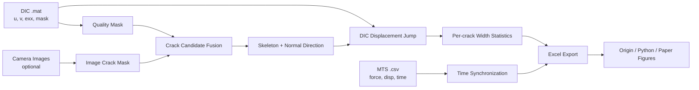

# CrackVision-DIC

ECC / SHCC 拉伸试验最麻烦的不是拿到 DIC 数据，而是把 `.mat`、相机裂缝图、MTS 曲线变成一套能复核、能画图、能写论文的裂缝演化数据。CrackVision-DIC 做的就是这件事。

一句话：**用 DIC 位移跳量计算裂缝宽度，用图像裂缝 mask 辅助定位，用 MTS 时间序列校准力学状态，最后把所有结果落成干净 Excel。**

我不太喜欢“一个阈值包治百病”的裂缝分析。ECC 的裂缝太细，DIC 又太敏感，照片还会受光照和喷斑影响。单押一种方法，迟早被某一帧背刺。所以这个项目的策略很明确：

```text
主结果：DIC normal displacement jump
辅助定位：DIC high-exx zone + optional camera crack mask
交叉检查：image area / skeleton length + global strain estimate
最终复核：QA sheet + annotation validation
```

不是最花哨的路线，但够硬。实验数据不需要魔法，需要账本。

> GitHub README 的数学渲染不是完整 LaTeX。这里的公式全部用 GitHub 友好的写法，避免 `operatorname` 这类会被拦截的宏。

## 这套方法想解决什么

Ncorr / DICe / VIC-2D 已经能给出位移场和应变场，但论文里通常还要这些东西：

```text
crack count
crack spacing
per-crack width
median / P95 / max crack width
stress-strain synchronized crack evolution
target strain states
QA metadata
```

手动复制 Excel 可以做一次。做十组试件就会变成体力劳动 cosplay。

CrackVision-DIC 把这条链路自动化：


```mermaid
flowchart LR
    A[DIC .mat<br/>u, v, exx, mask] --> B[Quality Mask]
    C[Camera Images<br/>optional] --> D[Image Crack Mask]
    B --> E[Crack Candidate Fusion]
    D --> E
    E --> F[Skeleton + Normal Direction]
    A --> G[DIC Displacement Jump]
    F --> G
    G --> H[Per-crack Width Statistics]
    I[MTS .csv<br/>force, disp, time] --> J[Time Synchronization]
    H --> K[Excel Export]
    J --> K
    K --> L[Origin / Python / Paper Figures]
```

## 输入和输出

输入：

```text
DIC .mat
├─ u displacement map
├─ v displacement map        # 推荐必须有。斜裂缝 COD 靠它续命
├─ exx strain map
├─ valid mask / quality map
└─ scale / spacing / time metadata

camera images                # 可选，只辅助找裂缝位置
├─ images/*.png
├─ frames/*.jpg
└─ crack_images/*.tif

MTS .csv                     # 可选，但建议有
├─ time
├─ force / load
└─ displacement / extension
```

输出：

```text
[Specimen]_Origin_Plot_Data.xlsx
[Specimen]_Statistics_Report.xlsx
_Batch_Summary.xlsx
```

核心指标：

```text
crack_count
crack_spacing_mm
W_median_um
W_avg_um
W_95_um
W_99_um
W_max_um
W_image_area_skeleton_um
W_global_est_um
global_strain
Stress_MPa
QA_Metadata
```

不做的事：

```text
DIC solver
原始散斑相关匹配
自动修复失相关烂数据
替你判断所有实验是否可信
```

这个仓库是后处理，不是炼丹炉。

## 🚀 快速开始

要求：Python >= 3.10。

```bash
git clone https://github.com/liqinglq666/CrackVision-DIC.git
cd CrackVision-DIC

conda create -n crackvision_env python=3.10 -y
conda activate crackvision_env

pip install -r requirements.txt
python main.py
```

跑测试：

```bash
python -m pytest
```

Windows 上别直接敲 `pytest`，容易串到别的 Python。老坑，别踩第二次。

```bash
python --version
where python
python -m pytest
```

## 数据怎么放

单个试件随便选文件即可。批处理建议这么放：

```text
Experiment_Root/
├─ Specimen_A/
│  ├─ A.mat
│  ├─ A.csv
│  └─ images/
│     ├─ 0000.png
│     ├─ 0001.png
│     └─ ...
├─ Specimen_B/
│  ├─ B.mat
│  ├─ B.csv
│  └─ images/
└─ Specimen_C/
   ├─ C.mat
   ├─ C.csv
   └─ images/
```

相机图像和 DIC ROI 要对齐。整张试件照片直接丢进来，而 DIC 只分析中间 ROI，结果会很有想象力。科研里最贵的不是算法，是配准意识。

## GUI 怎么跑

### Single

```text
1. 选择 DIC .mat
2. 可选 MTS .csv
3. 选择输出目录
4. 检查物理参数
5. Start
```

### Batch

```text
1. 选择 DIC 工作目录
2. 打开智能挂载台
3. 选择 MTS 目录
4. 严格 token 自动配对
5. 手动检查 E1 / E10 这种危险命名
6. Start
```

自动匹配是保守的。匹配不到就手动指定。宁可慢 10 秒，也别把 A 组力学曲线接到 B 组裂缝图上。那种错误看起来很顺，死得也很安静。

## 方法论核心

### 1. 尺度分离：raw pixel 和 DIC grid 不是一回事

DIC 输出的位移通常以 raw image pixel 为单位；裂缝长度、搜索距离、骨架步长则发生在 DIC subset grid 上。这两个尺度必须分开。

$$
\Delta x_{DIC}=s_{px}p_{mm}
$$

其中：

```text
p_mm   = pixel_size_mm, raw image scale, mm / px
s_px   = subset_spacing_px, raw pixels / DIC point
Δx_DIC = dic_point_spacing_mm, mm / DIC point
```

使用规则：

```text
u/v displacement jump  -> pixel_size_mm
crack length           -> dic_point_spacing_mm
normal search distance -> dic_point_spacing_mm
virtual gauge length   -> dic_point_spacing_mm
```

把这俩混起来，结果不会报错，只会悄悄偏。软件最阴的错误一般都不崩溃。

### 2. 裂缝候选区：高应变区不是裂缝本身

DIC 的 `exx` 高值区适合找裂缝位置，但不能直接把高应变带宽度当裂缝宽度。因为它受 subset size、step size、平滑、失相关影响。

这里用稳健阈值找候选裂缝区：

$$
\varepsilon_{th}=\mathrm{median}(\varepsilon_{xx})+k \cdot 1.4826 \cdot \mathrm{MAD}(\varepsilon_{xx})
$$

候选区域写成：

$$
\Omega_s=\{(x,y):\varepsilon_{xx}(x,y)>\varepsilon_{th}\}
$$

再可选融合相机裂缝 mask：

$$
\Omega_c=\Omega_s \cup \Omega_i
$$

默认 `strain_or_image`，因为 ECC 细裂缝有时候在图像里清楚、在 DIC 应变里被平滑掉；反过来，也有裂缝在照片里被喷斑和光照淹掉。两个传感源互相兜底，别装清高。

可选融合模式：

```text
strain_or_image       # 默认：敏感，适合 ECC 细裂缝
strain_and_image      # 严格：降低误检，但可能漏裂缝
image_near_strain     # 折中：图像裂缝必须靠近高 exx 支撑
image_only            # 只用照片找裂缝；能跑，不建议做主方法
strain_only           # 只用 DIC 高应变区；适合不信任图像 mask 的情况
```

### 3. 裂缝宽度主算法：DIC 法向位移跳量

裂缝宽度不应该从 `exx` 带宽直接读。主结果来自裂缝两侧位移场的法向跳量。

对骨架点 `x_c`，局部法向为 `n = (n_x, n_y)`，两侧采样点为：

$$
x^+=x_c+dn, \quad x^-=x_c-dn
$$

裂缝开口位移：

$$
w(x_c)=\left|\left[u(x^+)-u(x^-)\right] \cdot n\right|p_{mm}
$$

展开就是代码里的公式：

$$
w=\left|(u^+-u^-)n_x+(v^+-v^-)n_y\right|p_{mm}
$$

如果没有 `v`，只能退化成：

$$
w\approx\left|(u^+-u^-)n_x\right|p_{mm}
$$

这能跑，但不够漂亮。斜裂缝会被低估。所以默认：

```yaml
physics:
  require_v_map_for_cod: true
```

缺 v 时直接写：

```text
missing_v_map_required
```

不是程序矫情，是物理不让步。

### 4. 为什么导出 median / P95，而不是只看 max

每条裂缝会有一组采样宽度：

$$
W_i=\{w_{i,1},w_{i,2},...,w_{i,m}\}
$$

导出：

$$
w_{i,median}=\mathrm{median}(W_i)
$$

$$
w_{i,avg}=\frac{1}{m}\sum_{j=1}^{m}w_{i,j}
$$

$$
w_{i,95}=Q_{0.95}(W_i), \quad w_{i,max}=\max(W_i)
$$

`max` 保留，但不供奉。DIC 在裂缝边缘很容易有局部噪点，最大值太容易戏剧化。论文里我更建议报告：

```text
主宽度：W_median_um 或 W_avg_um
安全上限：W_95_um
极端值：W_max_um，仅作补充
```

如果一张图里只有 max 好看，那通常不是结果强，是数据脏。

### 5. 图像法宽度：只做交叉检查

相机图像 mask 可以给一个面积/骨架长度估算宽度：

$$
w_{img}=\frac{A_{crack}}{L_{skeleton}}
$$

对应输出：

```text
W_image_area_skeleton_um
```

它适合看趋势，也适合发现 DIC 位移跳量是否离谱。但它不是主 COD，因为照片黑线宽度会被光照、喷斑、阈值、焦距和表面纹理污染。图像法很有用，但别把它神化。

### 6. 全局估算宽度：粗糙但很适合抓 bug

如果当前裂缝数量为 `N_c`，virtual gauge length 为 `L_v`，平均裂缝间距：

$$
\bar{s}=\frac{L_v}{N_c}
$$

若填入弹性模量 `E`，裂缝贡献应变估算为：

$$
\varepsilon_{cr}=\max\left(0,\varepsilon_{global}-\frac{\sigma}{E}\right)
$$

全局平均裂缝宽度估算：

$$
w_{global}=\varepsilon_{cr}\bar{s}
$$

其中：

$$
\sigma=\frac{F}{A}
$$

输出：

```text
W_global_est_um
```

这个值很粗，但很有用。如果 `W_DIC` 和 `W_global_est` 差一个数量级，别急着解释机理，先查 scale、spacing、MTS 同步和 v map。科研不是文学创作，不能靠想象补洞。

### 7. 时间同步：先把时钟对齐，再谈演化

DIC 每帧时间：

```text
优先级：
1. .mat metadata: time / time_s / frame_time / timestamp
2. fallback: Frame_ID × sampling_interval_s
```

MTS 插值到 DIC 时间轴：

$$
\sigma(t_{DIC})=\mathrm{interp}(\sigma_{MTS}(t),t_{DIC})
$$

重叠不足、缺失比例过高，就拒绝同步，并写入：

```text
sync_status
```

我宁愿让程序说“不同步”，也不想让它画出一条漂亮但假的 stress-crack width 曲线。

## 配置重点

主配置：

```text
config/default.yaml
```

常用参数：

```yaml
experiment:
  mm_per_pixel: 0.045
  dic_subset_spacing_px: 1.0
  sampling_interval_s: 5.0
  cross_section_area_mm2: 100.0
  gauge_length_mm: 80.0

sync:
  min_overlap_fraction: 0.60
  max_missing_fraction: 0.05
  dic_time_offset_s: 0.0
  mts_time_offset_s: 0.0

crack_detection:
  fusion_mode: strain_or_image
  image_dilation_radius_points: 1
  require_strain_support: false

image_crack_detection:
  enabled: false
  image_dir:
  filename_pattern:
  frame_index_offset: 0
  dark_cracks: true

physics:
  strain_threshold_k: 1.5
  require_v_map_for_cod: true
  elastic_modulus_mpa:

  cod_sampling:
    delta_points: 3
    max_search_points: 15
    delta_mm:
    max_search_mm:

  cod_min_mm: 0.002
  cod_min_mean_mm: 0.002
  cod_max_mm: 5.0
```

我更推荐正式数据用物理采样距离，而不是固定 points：

```yaml
physics:
  cod_sampling:
    delta_mm: 0.10
    max_search_mm: 0.50
```

原因很简单：DIC step 换了，points 的物理意义也换了。毫米不会背叛你，points 会。

## 相机图像辅助怎么开

默认关闭。要用就改：

```yaml
image_crack_detection:
  enabled: true
  image_dir: images
  filename_pattern:
  frame_index_offset: 0
  dark_cracks: true
```

如果图片叫：

```text
frame_0000.png
frame_0001.png
frame_0002.png
```

填：

```yaml
filename_pattern: frame_{frame:04d}.png
```

如果相机图像比 DIC frame 提前 2 帧：

```yaml
frame_index_offset: 2
```

Frame 0 会优先找：

```text
frame_0002.png
```

这个逻辑已经写进测试。按钮不是装饰品。

## 输出文件

### `[Specimen]_Origin_Plot_Data.xlsx`

画图用，少废字段。

```text
00_READ_ME
01_Frame_Curves
02_Target_States
03_Distribution_Tidy
04_Crack_Tidy
```

常用动作：

```text
应力-应变 / 裂缝数演化       -> 01_Frame_Curves
W_median / W_95 随应变变化    -> 01_Frame_Curves
箱线图 / 小提琴图             -> 03_Distribution_Tidy
每条裂缝宽度排名              -> 04_Crack_Tidy
```

### `[Specimen]_Statistics_Report.xlsx`

复核用，信息更全。

```text
00_Specimen_Summary
01_Frame_All
02_Target_Summary
03_Key_Crack_Details
04_Distribution_Tidy
05_QA_Frame_Status
06_QA_Metadata
07_Validation
```

### `_Batch_Summary.xlsx`

批处理总表。

```text
Specimen_Summary        # 每个试件一行
Target_Summary          # 每个试件 × 每个目标应变点一行
```

这是组间对比入口。别再把十几个 Excel 手动复制到一个总表里。那不是数据分析，是鼠标耐久测试。

## QA 不是装饰

每次跑完先看：

```text
05_QA_Frame_Status
06_QA_Metadata
```

重点字段：

```text
pixel_size_mm
subset_spacing_px
dic_point_spacing_mm
metadata_source
dic_time_source
v_map_present
image_mask_present
image_mask_source
crack_detection_source
quality_valid_fraction
cod_status
sync_status
strain_source
```

快速判断：

```text
metadata_source 全是 config_fallback
-> 检查比例尺和 subset spacing

dic_time_source 是 frame_index_interval_fallback
-> 检查 sampling_interval_s

v_map_present = False 且 require_v_map_for_cod = true
-> COD 不会算，别怪 Excel 空

image_mask_present 一直 False
-> 图片没读到，或图像辅助没开

quality_valid_fraction 很低
-> DIC 质量有问题，这帧别拿去撑结论

sync_status != synced
-> MTS 没对齐，别画 stress-crack width 联动结论
```

## 人工标注对照

在 `.mat` 同目录放：

```text
[Specimen]_annotations.csv
```

最小格式：

```csv
Frame,crack_count,W_median_um,W_avg_um,W_95_um,W_max_um
0,0,0,0,0,0
10,3,16.5,18.2,35.1,41.5
20,7,28.0,31.0,70.2,86.4
```

结果会写入：

```text
07_Validation
```

不用全标。挑代表性应变点就够：初裂、应变硬化中段、裂缝饱和、极限前。少量人工标注能救很多论文审稿问题。

## 我建议论文里怎么写

别写“本研究采用图像处理方法计算裂缝宽度”这种含糊话。太软。

可以写成这种结构：

```text
Crack locations were first identified from a fused crack candidate field constructed from DIC high-strain localization and optional image-based crack masks. Crack width was then quantified from the displacement discontinuity normal to the local crack skeleton. Image-based area/skeleton width and global strain-based width were used only as consistency checks.
```

中文可以这么讲：

```text
本文不直接以 DIC 应变带宽度作为裂缝宽度，而是将高应变局部化区域用于裂缝定位，并基于裂缝骨架法向两侧的 DIC 位移跳量计算 crack opening displacement。为降低单一识别源带来的误判，进一步引入相机图像裂缝 mask 作为裂缝位置先验，并采用图像面积/骨架长度法及全局应变估算法作为交叉验证指标。
```

核心公式放这几个就够：

$$
\varepsilon_{th}=\mathrm{median}(\varepsilon_{xx})+k \cdot 1.4826 \cdot \mathrm{MAD}(\varepsilon_{xx})
$$

$$
w=\left|(u^+-u^-)n_x+(v^+-v^-)n_y\right|p_{mm}
$$

$$
w_{img}=\frac{A_{crack}}{L_{skeleton}}
$$

$$
w_{global}=\max\left(0,\varepsilon_{global}-\frac{\sigma}{E}\right)\frac{L_v}{N_c}
$$

公式别堆太多。该有的有，评审就知道你不是在靠软件截图讲故事。

## 常见翻车点

### 裂缝太多

```yaml
physics:
  strain_threshold_k: 2.0
  min_crack_area_points: 20
  cod_min_mm: 0.005
```

或者更保守：

```yaml
crack_detection:
  fusion_mode: image_near_strain
```

### 裂缝断得太碎

```yaml
physics:
  strain_threshold_k: 1.2
```

或者开图像辅助：

```yaml
image_crack_detection:
  enabled: true
crack_detection:
  fusion_mode: strain_or_image
```

### COD 全是 0

看：

```text
v_map_present
cod_status
```

如果是：

```text
missing_v_map_required
```

要么补 v map，要么关掉：

```yaml
physics:
  require_v_map_for_cod: false
```

关掉能跑，但斜裂缝会退化。能用，不要吹过头。

### 图像 mask 没参与

看：

```text
image_mask_present
image_mask_source
crack_detection_source
```

如果一直是 `image_mask_missing`，就是路径或文件名模板不对。别让程序猜你的文件命名哲学。

### MTS 同步失败

先查：

```yaml
experiment:
  sampling_interval_s: 5.0

sync:
  dic_time_offset_s: 0.0
  mts_time_offset_s: 0.0
```

再查 CSV 表头有没有：

```text
time / sec / second / 时间 / 秒
load / force / kn / 载荷 / 力
disp / displacement / extension / 位移 / 伸长
```

## 本地开发

```bash
pip install -r requirements.txt
python -m pytest
python main.py
```

只跑核心测试：

```bash
python -m pytest tests/test_core_contracts.py
```

测试盯的不是摆设：

```text
缺 v map 必须明确返回 missing_v_map_required
DIC strains/displacements 帧数不一致必须直接报错
.mat 有时间轴就用 metadata time
.mat 没时间轴就用 sampling_interval_s
Excel 导出不能带 object payload
目标应变没达到也必须保留 not_reached 行
分布表必须是 tidy long format
图像 mask 能参与裂缝 skeleton
strain_only 必须真的忽略 image mask
image_near_strain 的 QA 名字必须和 UI 一致
filename_pattern 必须优先使用 offset 后的 frame
COD 必须导出 median / P95
全局估算宽度能扣除 sigma/E
```

## 目录

```text
CrackVision-DIC
├─ main.py
├─ config/
│  └─ default.yaml
├─ src/
│  ├─ core/
│  │  ├─ image_crack.py          # 相机图像 crack mask
│  │  ├─ io_sync.py              # MAT 读取、metadata、时间轴
│  │  ├─ physics.py              # skeleton、COD、quality mask、融合逻辑
│  │  ├─ evolution_analyzer.py   # MTS CSV 同步
│  │  └─ models.py
│  └─ gui/
│     ├─ main_window.py          # GUI 参数面板
│     └─ worker.py               # pipeline + Excel export
├─ tests/
│  └─ test_core_contracts.py
├─ pytest.ini
└─ requirements.txt
```

## 最后一句

主结果看 DIC normal displacement jump；图像法和全局估算法负责找茬；QA 表负责防止自己骗自己。裂缝宽度这种东西，算得漂亮不难，难的是知道哪里可能错。
