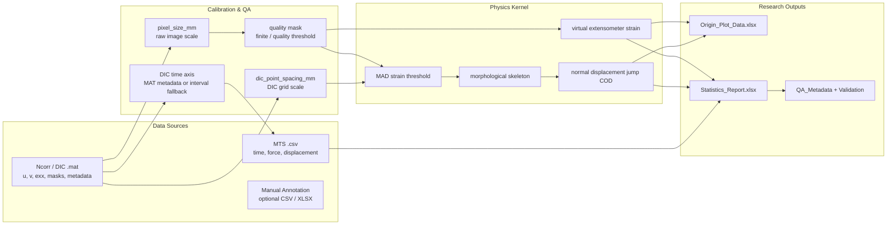

# CrackVision-DIC

[](https://www.python.org/downloads/)
[](https://wiki.qt.io/Qt_for_Python)
[](#)

CrackVision-DIC 是一个面向 ECC / UHPC / cementitious composites 拉伸试验的 DIC 裂缝演化后处理系统。它不替代 Ncorr、DICe、VIC-2D 等原始 DIC solver，而是读取 DIC 导出的 `.mat` 位移场、应变场与空间标定信息，并与 MTS 力学时序数据进行同步，输出 crack count、crack spacing、COD、宽度分位数、应变梯度切片和 QA metadata。

本项目的核心目标是建立一条可审计、可复现、可解释的 micro-cracking kinetics pipeline：从 DIC grid 到裂缝骨架，从法向位移跳量到裂缝宽度，从宏观载荷时序到微观裂缝统计，最后形成可以直接进入 Origin、论文表格和数据复核流程的结构化结果。

## 核心可靠性改造

本版本重点加强了数据可信度，而不是只增加图表数量：

- DIC 时间轴优先使用 `.mat` 元数据；若缺失，才使用 `Frame × sampling_interval_s` 兜底。
- GUI 暴露 `sampling_interval_s`，避免 MTS 同步被隐藏默认值污染。
- `strains` 与 `displacements` 帧数不一致时直接报错，不再用 `zip()` 静默截断。
- 批处理 MTS 匹配改为严格 token 匹配，避免 `E1` 误配 `E10`。
- 配置文件路径改为项目根目录锚定，避免从不同工作目录启动时读取错误默认值。
- `require_v_map_for_cod: true` 且缺少 `v` 位移场时，输出明确状态 `missing_v_map_required`。
- `metadata_source` 细分为 `ratio:...;spacing:...`，方便审查比例尺到底来自 MAT 还是 config fallback。
- QA 表增加 `dic_time_source`，用于追踪时间轴来自真实元数据还是帧间隔兜底。

## System Overview


```mermaid
flowchart LR
    subgraph Input["Data Sources"]
        A["Ncorr / DIC .mat<br/>u, v, exx, masks, metadata"]
        B["MTS .csv<br/>time, force, displacement"]
        C["Manual Annotation<br/>optional CSV / XLSX"]
    end

    subgraph Calibration["Calibration & QA"]
        D["pixel_size_mm<br/>raw image scale"]
        E["dic_point_spacing_mm<br/>DIC grid scale"]
        T["DIC time axis<br/>MAT metadata or interval fallback"]
        Q["quality mask<br/>finite / quality threshold"]
    end

    subgraph Physics["Physics Kernel"]
        H["MAD strain threshold"]
        I["morphological skeleton"]
        J["normal displacement jump COD"]
        K["virtual extensometer strain"]
    end

    subgraph Export["Research Outputs"]
        L["Origin_Plot_Data.xlsx"]
        M["Statistics_Report.xlsx"]
        N["QA_Metadata + Validation"]
    end

    A --> D --> Q
    A --> E --> H
    A --> T --> B
    Q --> H --> I --> J
    Q --> K
    B --> M
    J --> L
    K --> L
    J --> M
    K --> M
    M --> N
```

## 适用范围

- ECC / UHPC 单轴拉伸或直接拉伸试验的 DIC 后处理；
- Ncorr `.mat` displacement / strain field 数据批量分析；
- 裂缝数量、裂缝间距、平均 COD、最大 COD、P99 COD 的时序提取；
- DIC virtual extensometer strain 与 MTS stress / displacement 的时域同步；
- 面向 OriginLab、Excel、Python plotting 的宽表导出；
- 人工标注对照、质量掩码、尺度信息和同步状态的 QA 追踪。

它不负责从原始 speckle images 中求解位移场。原始图像相关匹配仍建议在 Ncorr、DICe、VIC-2D 或同类 DIC solver 中完成。

## 计算逻辑

### 1. 双尺度空间标定

DIC 位移值通常以 raw image pixel displacement 表示，但 DIC 输出矩阵的采样点不是相机原始像素，而是 subset centers 组成的离散网格。因此本项目将两个尺度严格分离：

```text
pixel_size_mm        = raw image pixel scale, mm / px
subset_spacing_px    = DIC subset center spacing, px / point
dic_point_spacing_mm = pixel_size_mm * subset_spacing_px
```

- 位移跳量 `u, v` 的量纲转换使用 `pixel_size_mm`；
- 裂缝长度、骨架点间距、搜索半径、virtual extensometer 的几何距离使用 `dic_point_spacing_mm`；
- 这样可以避免把 DIC grid point 错当成 raw pixel，从而系统性低估或高估 crack length。

### 2. 时间轴与 MTS 同步

DIC 时间轴按以下优先级生成：

```text
1. 优先读取 .mat 中的 time / time_s / frame_time / timestamp 等字段
2. 若没有真实时间字段，则使用 Frame_ID * sampling_interval_s
3. 若 MTS 与 DIC 时间轴重叠不足，则拒绝同步并保留纯 DIC 结果
```

同步阶段会检查：

```math
\rho_t =
\frac{
\min(t_{DIC}^{max}, t_{MTS}^{max})-\max(t_{DIC}^{min}, t_{MTS}^{min})
}{
t_{DIC}^{max}-t_{DIC}^{min}
}
```

仅当 `rho_t >= sync.min_overlap_fraction` 时才进行插值同步。

### 3. 有效域与质量掩码

每一帧先建立有效计算域：

```math
\Omega_q = \Omega_{mask} \cap finite(u) \cap finite(v) \cap Q
```

其中 `Q` 可以来自 DIC quality map。若没有质量图，系统采用 `finite_only` 策略，只保留位移场和应变场数值有效的区域。

### 4. MAD-based strain segmentation

裂缝候选区域由 `exx` 场的稳健统计阈值提取：

```math
\varepsilon_{th}
= clip\left(
median(\varepsilon_{xx}) + k \cdot 1.4826 \cdot MAD,\;
\varepsilon_{min},\;
\varepsilon_{max}
\right)
```

随后执行 small-object filtering 与 skeletonization，将二维高应变带压缩为一像素宽的 crack skeleton。

### 5. Normal displacement jump COD

裂缝宽度采用跨裂缝两侧的法向位移跳量：

```math
w = \left| \Delta\mathbf u \cdot \mathbf n \right| \cdot pixel\_size\_mm
```

代码中的计算式为：

```text
w_mm = abs((u_plus - u_minus) * nx + (v_plus - v_minus) * ny) * pixel_size_mm
```

当 `physics.require_v_map_for_cod: true` 时，缺少 `v` 位移场会明确返回 `missing_v_map_required`，避免斜裂缝被单一水平位移投影低估。

### 6. Virtual extensometer strain

系统默认从 DIC 位移场中构造 virtual extensometer。它在有效区域左右两侧取竖向采样带，使用中位数位移差估计全局拉伸应变：

```math
\varepsilon_{DIC}
=
\frac{
|median(u_R)-median(u_L)| \cdot pixel\_size\_mm
}{
L_0
}
```

若配置了 `virtual_extensometer.gauge_length_mm`，使用该标距；否则由左右采样带在 DIC grid 中的距离自动估算。

## 配置入口

主要参数位于 `config/default.yaml`：

```yaml
experiment:
  mm_per_pixel: 0.045
  dic_subset_spacing_px: 1.0
  sampling_interval_s: 5.0
  cross_section_area_mm2: 100.0
  gauge_length_mm: 80.0

sync:
  min_overlap_fraction: 0.60
  max_missing_fraction: 0.05
  dic_time_offset_s: 0.0
  mts_time_offset_s: 0.0

quality:
  enabled: true
  metric_mode: finite_only
  threshold:
  min_valid_fraction: 0.20

physics:
  strain_threshold_k: 1.5
  require_v_map_for_cod: true
  cod_min_mm: 0.002
  cod_min_mean_mm: 0.002
  cod_max_mm: 5.0
  enforce_monotonic_strain: true
```

## 输出文件

每个 specimen 会生成两个主要 Excel 文件。

### `[Specimen]_Origin_Plot_Data.xlsx`

| Sheet | 内容 | 用途 |
| --- | --- | --- |
| `Fig1_Dynamics` | `Strain_pct`, `crack_count`, `crack_spacing_mm`, `W_avg_um`, `W_99_um`, `W_max_um` | 裂缝演化时序图 |
| `Fig2_Normalized` | normalized strain 与裂缝指标 | 不同试件归一化对比 |
| `Fig3_Distribution` | saturated / ultimate 宽度分布 | boxplot, violin plot, KDE |
| `Fig4_Gradient` | 指定应变水平的裂缝宽度切片 | strain-gradient ridgeline |

### `[Specimen]_Statistics_Report.xlsx`

| Sheet | 内容 | 用途 |
| --- | --- | --- |
| `01_Macro_Summary` | UTS、极限应变、饱和裂缝数量、宽度摘要、尺度与时间轴来源 | 论文 Table 与批量汇总 |
| `02_Gradient_States` | 0.5%、1%、2% 等应变点的状态统计 | 梯度演化分析 |
| `03_Saturated_Cracks` | 饱和状态单裂缝明细 | crack-level audit |
| `04_Ultimate_Cracks` | 极限状态单裂缝明细 | failure-state audit |
| `05_QA_Metadata` | scale、time source、quality、COD status、sync status | 数据可信度追踪 |
| `06_Validation` | 人工标注对比误差 | manual annotation validation |

## 安装与运行

```bash
git clone https://github.com/liqinglq666/CrackVision-DIC.git
cd CrackVision-DIC

conda create -n crackvision_env python=3.10 -y
conda activate crackvision_env

pip install -r requirements.txt
python main.py
```

## 测试

```bash
pytest
```

当前测试覆盖：

- 缺少 `v_map` 时 COD 返回明确状态；
- DIC 帧数不一致时拒绝静默截断；
- `.mat` 时间轴缺失时回退到 `sampling_interval_s`；
- `.mat` 时间轴存在时优先使用元数据时间。

## 建议的数据审查流程

1. 检查 `05_QA_Metadata` 中的 `pixel_size_mm`、`subset_spacing_px`、`dic_point_spacing_mm` 是否与 DIC solver 设置一致。
2. 检查 `dic_time_source`：若为 `frame_index_interval_fallback`，务必确认 GUI 中的 DIC 帧间隔填写正确。
3. 检查 `quality_valid_fraction`，低质量帧不建议用于最终论文统计。
4. 对 3 到 5 个关键帧做 manual annotation，并查看 `06_Validation`。
5. 对比 `Strain_pct` 与 MTS displacement strain，确认时间同步和标距设置合理。
6. 查看 `cod_status`，若出现 `missing_v_map_required`，说明当前数据缺少 v 位移场，不应直接解释为“无裂缝”。

## License

本仓库目前未单独发布开源许可证。使用、复用或二次发布前，请先确认授权方式。
